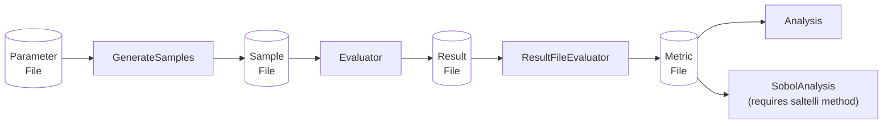

# Command Line Tools

The MOEA Framework contains a handful of command line tools for running large-scale experiments.  Any of these
tools can be run with:

```bash
java -classpath "lib/*" org.moeaframework.analysis.tools.<Command>
```

followed by any required and optional arguments.  Use the `-h` / `--help` flag to display all available options.

## Solve

The `Solve` tool is used to execute a single run of an algorithm on a problem.  This can use any built-in problem
or an externally-defined problem.

<!-- help:src/org/moeaframework/analysis/tools/Solve.java [:-2] -->

```
usage: java -classpath "lib/*" org.moeaframework.analysis.tools.Solve -a <name> [-b <name>] [-c <value>] [-e
       <e1,e2,...>] -f <file> [-F <value>] [-h] [-H <value>] [-l <v1,v2,...>] -n <value> [-o <value>] [-P <value>] [-r
       <value>] [-s <value>] [-S] [-t <trials>] [-u <v1,v2,...>] [-v <v1,v2,...>] [-x <p1=v1;p2=v2;...>]

Solves an optimization problem using any optimization algorithm supported by the MOEA Framework.  The following options
are available:

 -a,--algorithm <name>               Algorithm name
 -b,--problem <name>                 Problem name
 -c,--constraints <value>            Number of constraints (default 0)
 -e,--epsilon <e1,e2,...>            Epsilon values for epsilon-dominance
 -f,--output <file>                  Output file
 -F,--runtimeFrequency <value>       Output population every N evaluations (default 100)
 -h,--help                           Display help information
 -H,--hostname <value>               Hostname used when using sockets (default localhost)
 -l,--lowerBounds <v1,v2,...>        Lower bounds of real-valued decision variables
 -n,--numberOfEvaluations <value>    Maximum number of evaluations
 -o,--objectives <value>             Number of objectives
 -P,--port <value>                   Port used when using sockets (default 16801)
 -r,--retries <value>                The number of retries when establishing a socket connection (default 5)
 -s,--seed <value>                   Random number seed
 -S,--useSocket                      Communicate with external problem using sockets
 -t,--test <trials>                  Runs a few trials to test the connection with the external problem
 -u,--upperBounds <v1,v2,...>        Upper bounds of real-valued decision variables
 -v,--variables <v1,v2,...>          Comma-separated list of decision variable specifications.  Use "R(<lb>:<ub>)" for
                                     real-valued, "B(<length>)" for binary, "I(<lb>:<ub>)" for integer-valued, and
                                     "P(<length>)" for permutations
 -x,--properties <p1=v1;p2=v2;...>   Algorithm properties
```

## Sensitivity Analysis

This section details the steps to perform a sensitivity analysis study in the format as:

> Hadka, D. and Reed, P.  "Diagnostic Assessment of Search Controls and Failure Modes in Many-Objective
> Evolutionary Optimization."  Evolutionary Computation, 20(3):423-452.

The diagram below depicts the steps along with intermediate file formats:



### Parameter File

We start with a parameter file that defines the parameters being investigated along with the minimum and maximum bounds
for sampling.

<!-- text:examples/org/moeaframework/examples/experiment/NSGAII_Params.txt -->

```text
maxEvaluations 1000 10000
populationSize 10 500
sbx.rate 0.0 1.0
sbx.distributionIndex 1.0 50.0
pm.rate 0.0 1.0
pm.distributionIndex 1.0 50.0
```

### Generate Samples

Using the parameter file we defined above, we generate the actual parameter samples.  Each line in the output
file contains the parameters for a single execution.  Also note that the choice of sample generation method can affect
the type of analyses that can be performed.  For example, to compute the first, second, and total-order effects of the
parameters using Sobol sensitivity analysis, use the `saltelli` method. 

<!-- help:src/org/moeaframework/analysis/tools/SampleGenerator.java [:-2] -->

```
usage: java -classpath "lib/*" org.moeaframework.analysis.tools.SampleGenerator [-h] -m <name> -n <value> [-o <file>] -p
       <file> [-s <value>]

Generates parameter samples for running the Evaluator.  The following options are available:

 -h,--help                      Display help information
 -m,--method <name>             Sample generation method (uniform, latin, sobol, saltelli)
 -n,--numberOfSamples <value>   Number of samples
 -o,--output <file>             Output file
 -p,--parameterFile <file>      Parameter file
 -s,--seed <value>              Random number generator seed
```

### Evaluating each Sample

Next, we evaluate the algorithm against each of the parameter samples.  This produces a "result file" that contains
the Pareto approximation sets produced by each parameterization.

<!-- help:src/org/moeaframework/analysis/tools/Evaluator.java [:-2] -->

```
usage: java -classpath "lib/*" org.moeaframework.analysis.tools.Evaluator -a <name> [-b <name>] [-e <e1,e2,...>] [-f]
       [-h] -i <file> [-m] [-n] -o <file> -p <file> [-r <file>] [-s <value>] [-x <p1=v1;p2=v2;...>]

Evaluates an optimization algorithm on the specified problem.  The following options are available:

 -a,--algorithm <name>               Algorithm name
 -b,--problem <name>                 Problem name
 -e,--epsilon <e1,e2,...>            Epsilon values for epsilon-dominance
 -f,--force                          Continue processing if the file timestamp check fails
 -h,--help                           Display help information
 -i,--input <file>                   Parameter samples
 -m,--metrics                        Evaluate and output metrics
 -n,--novariables                    Do not output decision variables
 -o,--output <file>                  Output file
 -p,--parameterFile <file>           Parameter description file
 -r,--reference <file>               Reference set file
 -s,--seed <value>                   Random number seed
 -x,--properties <p1=v1;p2=v2;...>   Fixed algorithm properties
```

### Computing Metrics

We typically evaluate the performance of an algorithm using one of the performance indicators (e.g., hypervolume).
Here, we take the result file produced in the previous step and compute the metrics.

<!-- help:src/org/moeaframework/analysis/tools/ResultFileEvaluator.java [:-2] -->

```
usage: java -classpath "lib/*" org.moeaframework.analysis.tools.ResultFileEvaluator -b <name> | -d <number>  [-e
       <e1,e2,...>] [-f] [-h] -i <file> -o <file> [-r <file>]

Evaluates the approximation sets stored in a result file, outputting a metric file containing the hypervolume,
generational distance, inverted generational distance, spacing, additive epsilon-indicator, and maximum Pareto front
error performance indicators.  The following options are available:

 -b,--problem <name>        Problem name
 -d,--dimension <number>    Number of objectives
 -e,--epsilon <e1,e2,...>   Epsilon values for epsilon-dominance
 -f,--force                 Continue processing if the file timestamp check fails
 -h,--help                  Display help information
 -i,--input <file>          Input result file
 -o,--output <file>         Output metric file
 -r,--reference <file>      Reference set file
```

### Controllability Analysis

In our original sensitivity analysis study, we compared algorithms based on their attainment, efficiency, and
controllability.  These values are computed using the `Analysis` tool.

<!-- help:src/org/moeaframework/analysis/tools/Analysis.java [:-2] -->

```
usage: java -classpath "lib/*" org.moeaframework.analysis.tools.Analysis [-b <width>] [-c] [-e] [-h] -i <file> -m
       <value> [-o <file>] -p <file> [-t <percent>]

Calculates the best, attainment, efficiency and controllability metrics.  The following options are available:

 -b,--band <width>           NFE band width for calculating efficiency
 -c,--controllability        Include controllability calculation
 -e,--efficiency             Include efficiency calculation
 -h,--help                   Display help information
 -i,--parameters <file>      Parameter samples
 -m,--metric <value>         Column in metric file to evaluate
 -o,--output <file>          Output file
 -p,--parameterFile <file>   Parameter file
 -t,--threshold <percent>    Attainment threshold
```

### Parameter Sensitivities

If using the `saltelli` sampling method, we can also compute the first-, second-, and total-order effects of the
parameters.  This measures how much influence each parameter, or pair, contributes to the performance of the
algorithm.

<!-- help:src/org/moeaframework/analysis/tools/SobolAnalysis.java [:-2] -->

```
usage: java -classpath "lib/*" org.moeaframework.analysis.tools.SobolAnalysis [-h] -i <file> -m <value> [-o <file>] -p
       <file> [-r <number>] [-s]

Performs Sobol' global variance analysis.  The following options are available:

 -h,--help                   Display help information
 -i,--input <file>           Model output file
 -m,--metric <value>         Column in model output to evaluate
 -o,--output <file>          Output file
 -p,--parameterFile <file>   Parameter description file
 -r,--resamples <number>     Number of resamples when computing bootstrap confidence intervals
 -s,--simple                 Simple output format
```

## Runtime Dynamics

Whereas the `Evaluator` only outputs end-of-run results, the `RuntimeEvaluator` outputs the approximation set at
some sampling frequency.  Also note that this tool creates a separate file for each parameterization.  The output
file name should include `%d` which is replaced by the run id, such as `-o "result_%d.dat"`.

<!-- help:src/org/moeaframework/analysis/tools/RuntimeEvaluator.java [:-2] -->

```
usage: java -classpath "lib/*" org.moeaframework.analysis.tools.RuntimeEvaluator -a <name> [-b <name>] [-e <e1,e2,...>]
       [-f <nfe>] [-h] -i <file> [-n] -o <file> -p <file> [-s <value>] [-x <p1=v1;p2=v2;...>]

Records the approximation set at a fixed sampling frequency from each parameterization.  The following options are
available:

 -a,--algorithm <name>               Algorithm name
 -b,--problem <name>                 Problem name
 -e,--epsilon <e1,e2,...>            Epsilon values for epsilon-dominance
 -f,--frequency <nfe>                The sampling frequency in function evaluations
 -h,--help                           Display help information
 -i,--input <file>                   Parameter samples
 -n,--novariables                    Do not output decision variables
 -o,--output <file>                  Output file name format with %d replaced by the run index (e.g., result_%d.dat)
 -p,--parameterFile <file>           Parameter description file
 -s,--seed <value>                   Random number seed
 -x,--properties <p1=v1;p2=v2;...>   Fixed algorithm properties
```

## Result File Tools

A result file is a file format generated by the `Solve` and `Evaluate` tools.  We also provide several tools for
processing these result files.

### Info

Counts the number of valid entries in a result file.  This is useful to validate that all runs are complete.

<!-- help:src/org/moeaframework/analysis/tools/ResultFileInfo.java [:-2] -->

```
usage: java -classpath "lib/*" org.moeaframework.analysis.tools.ResultFileInfo -b <name> | -d <number>  [-h] [-o <file>]

Outputs the number of approximation sets stored in a result file.  The following options are available:

 -b,--problem <name>       Problem name
 -d,--dimension <number>   Number of objectives
 -h,--help                 Display help information
 -o,--output <file>        Output file
```

### Creating Reference Set

If a true reference set is not available for a problem, we can produce a reference set by combining all approximation
sets across all algorithms and runs.

<!-- help:src/org/moeaframework/analysis/tools/ResultFileMerger.java [:-2] -->

```
usage: java -classpath "lib/*" org.moeaframework.analysis.tools.ResultFileMerger -b <name> | -d <number>  [-e
       <e1,e2,...>] [-h] -o <file> [-r]

Merges the approximation sets contained in one or more result files to produce the combined reference set.  The
following options are available:

 -b,--problem <name>        Problem name
 -d,--dimension <number>    Number of objectives
 -e,--epsilon <e1,e2,...>   Epsilon values for epsilon-dominance
 -h,--help                  Display help information
 -o,--output <file>         Output file containing the merged set
 -r,--resultFile            Output result file instead of reference set
```

### Merging Approximation Sets across Multiple Seeds

If running multiple repetitions with different random-number seeds, we can merge the approximation sets for each
parameterization.

<!-- help:src/org/moeaframework/analysis/tools/ResultFileSeedMerger.java [:-2] -->

```
usage: java -classpath "lib/*" org.moeaframework.analysis.tools.ResultFileSeedMerger -b <name> | -d <number>  [-e
       <e1,e2,...>] [-h] -o <file>

Merges the approximation sets contained in one or more result files across each seed, where each result file is
generated by a different seed.  Unlike ResultFileMerger that merges all approximation sets into one reference set, this
utility merges each entry across its seeds.  The output will contain N approximation sets if the inputs all contain N
approximation sets.  The following options are available:

 -b,--problem <name>        Problem name
 -d,--dimension <number>    Number of objectives
 -e,--epsilon <e1,e2,...>   Epsilon values for epsilon-dominance
 -h,--help                  Display help information
 -o,--output <file>         Output file
```

### Extract Data

Extracts any metadata or evaluates performance metrics for the entries in the result file.  The names of the properties
to extract are given as additional arguments.  To evaluate performance metrics, simply specify the name of the
indicator, such as `Hypervolume` or `GenerationalDistance`.

<!-- help:src/org/moeaframework/analysis/tools/ExtractData.java [:-2] -->

```
usage: java -classpath "lib/*" org.moeaframework.analysis.tools.ExtractData -b <name> | -d <number>  [-e <e1,e2,...>]
       [-h] -i <file> [-n] [-o <file>] [-r <file>] [-s <value>]

Extracts metadata and/or performance metrics from a result file, storing the data in a spreadsheet-like format.  The
following options are available:

 -b,--problem <name>        Problem name
 -d,--dimension <number>    Number of objectives
 -e,--epsilon <e1,e2,...>   Epsilon values for epsilon-dominance
 -h,--help                  Display help information
 -i,--input <file>          Input file
 -n,--noheader              Do not print header line
 -o,--output <file>         Output file
 -r,--reference <file>      Reference set file
 -s,--separator <value>     Separator between entries
```

### ARFF Converter

Converts the last record in a result file into the ARFF format, which is a common format used in data mining.

<!-- help:src/org/moeaframework/analysis/tools/ARFFConverter.java [:-2] -->

```
usage: java -classpath "lib/*" org.moeaframework.analysis.tools.ARFFConverter -b <name> | -d <number>  [-h] -i <file>
       [-n <arg>] -o <file> [-r]

Converts a result file into an ARFF file.  The following options are available:

 -b,--problem <name>       Problem name
 -d,--dimension <number>   Number of objectives
 -h,--help                 Display help information
 -i,--input <file>         Input file
 -n,--names <arg>          Names of the variables and objectives
 -o,--output <file>        Output file
 -r,--reduced              Only output objectives
```
