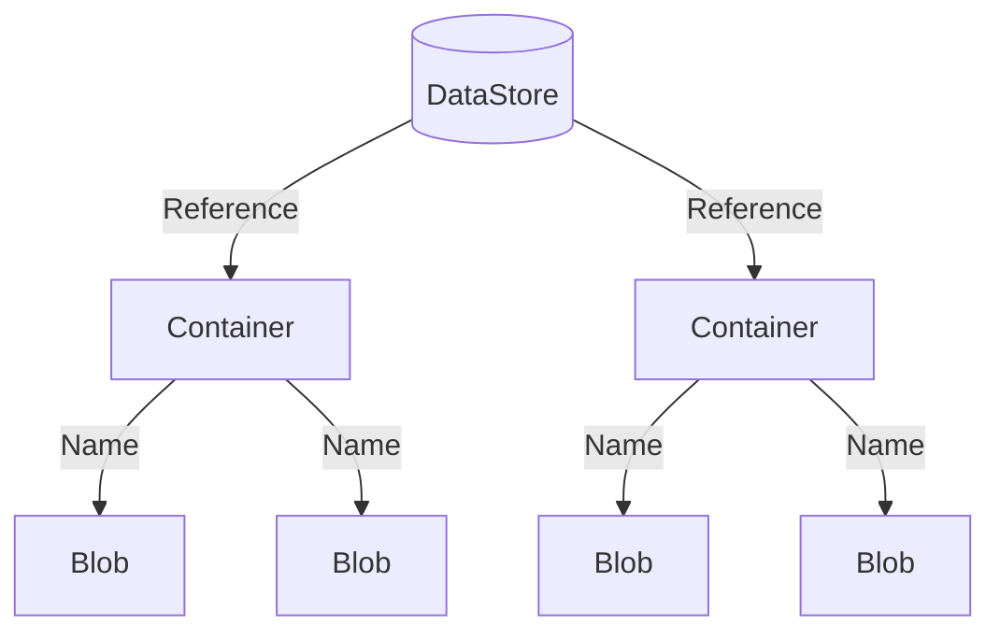

# Storing Experimental Data

Large experiments typically produce a large amount of data which must be organized and stored in some accessible way.
While you are certainly free to manage the data produced by the MOEA Framework in any manner, we also provide a
built-in storage solution called the **data store**.

## Introduction

A **data store** organizes content into **containers**, with each piece of data stored in a **blob**.  Containers are
uniquely identified by a **reference** and blobs by their **name**.  The diagram below shows this hierarchical
structure:



## Basic Usage

For this demonstration, we will create a data store backed by the file system.  Here, the content will be stored in the
`results/` directory.

<!-- java:test/org/moeaframework/snippet/DataStoreSnippet.java [datastore-create] -->

```java
DataStore dataStore = new FileSystemDataStore(new File("results"));
```

We access a container using a reference.  A reference contains one or more key-value pairs.  For example, below we
create a reference for `"populationSize"` set to `100`.

<!-- java:test/org/moeaframework/snippet/DataStoreSnippet.java [datastore-container] -->

```java
Reference reference = Reference.of("populationSize", 100);
Container container = dataStore.getContainer(reference);
```

Next, we can access blobs within the container by name.  Below, we create a blob named `"greeting"` and store the text
`"Hello world!"`.

<!-- java:test/org/moeaframework/snippet/DataStoreSnippet.java [datastore-blob] -->

```java
Blob blob = container.getBlob("greeting");
blob.storeText("Hello world!");

System.out.println(blob.extractText());
```

## File System Layout

Under the covers, the file system data store structures the content as folders and files.  If we were to look in the
`results/` folder, we would find the file structure:

> :file_folder: results/ <br/>
> &nbsp; &nbsp; &nbsp; :file_folder: populationSize/ <br/>
> &nbsp; &nbsp; &nbsp; &nbsp; &nbsp; &nbsp; :file_folder: 100/ <br/>
> &nbsp; &nbsp; &nbsp; &nbsp; &nbsp; &nbsp; &nbsp; &nbsp; &nbsp; :page_facing_up: greeting

Observe how the keys and values, in this case `populationSize` and `100`, form the folder hierarchy.  Suppose we
change the value to `200` and write the same blob:

<!-- java:test/org/moeaframework/snippet/DataStoreSnippet.java [datastore-layout] -->

```java
Reference reference = Reference.of("populationSize", 200);
Container container = dataStore.getContainer(reference);
```

We would see the following hierarchy:

> :file_folder: results/ <br/>
> &nbsp; &nbsp; &nbsp; :file_folder: populationSize/ <br/>
> &nbsp; &nbsp; &nbsp; &nbsp; &nbsp; &nbsp; :file_folder: 100/ <br/>
> &nbsp; &nbsp; &nbsp; &nbsp; &nbsp; &nbsp; &nbsp; &nbsp; &nbsp; :page_facing_up: greeting <br/>
> &nbsp; &nbsp; &nbsp; &nbsp; &nbsp; &nbsp; :file_folder: 200/ <br/>
> &nbsp; &nbsp; &nbsp; &nbsp; &nbsp; &nbsp; &nbsp; &nbsp; &nbsp; :page_facing_up: greeting

This layout also works with multiple key-value pairs, with each additional key-value pair producing nested folders.

## Storing Algorithm Results

Now let's look how the data store can integrate with the MOEA Framework by storing the results from an algorithm.
Here, we create a container based on the algorithm's unique configuration.

<!-- java:test/org/moeaframework/snippet/DataStoreSnippet.java [datastore-algorithm] -->

```java
Problem problem = new UF1();

NSGAII algorithm = new NSGAII(problem);
algorithm.run(10000);

Reference reference = Reference.of(algorithm.getConfiguration());
Container container = dataStore.getContainer(reference);

Blob blob = container.getBlob("result");
blob.storePopulation(algorithm.getResult());
```

But what happens if we run this code multiple times?  Each time, we will re-run the algorithm and overwrite the result
file.  We can improve upon this by first checking if the results exist before performing any expensive operations:

<!-- java:test/org/moeaframework/snippet/DataStoreSnippet.java [datastore-exists] -->

```java
if (!blob.exists()) {
    algorithm.run(10000);
    blob.storePopulation(algorithm.getResult());
}
```

One last point: while all of the properties defined by the algorithm's configuration are used to uniquely reference
its container, some run parameters including `seed` and `maxEvaluations` are not included in the configuration.  Instead,
we must modify the reference as follows:

<!-- java:test/org/moeaframework/snippet/DataStoreSnippet.java [datastore-seeds] -->

```java
for (int seed = 0; seed < 10; seed++) {
    PRNG.setSeed(seed);

    NSGAII algorithm = new NSGAII(problem);

    Reference reference = Reference.of(algorithm.getConfiguration()).with("seed", seed);
    Container container = dataStore.getContainer(reference);
    Blob blob = container.getBlob("result");

    if (!blob.exists()) {
        algorithm.run(10000);
        blob.storePopulation(algorithm.getResult());
    }
}
```

## CLI Interface

In the previous examples, we accessed containers and blobs through the programmatic interface.  We can also access
the content through the CLI.

To begin, each data store, container, and blob has a unique Uniform Resource Identifier (URI).  Similar to a URL one
uses to access a web page, the URI contains the necessary information to locate the data store, container, or blob.
Below are some example URIs:

```
# The data store rooted at the path ./results/
file://results

# The container with attributes populationSize=100 and seed=1
file://results?populationSize=100&seed=1

# The blob named "greeting"
file://results?populationSize=100&seed=1#greeting
```

The `datastore` CLI tools provide a number of operations that can be performed, including listing contents, reading or
writing to blobs, etc.

<!-- bash:.github/workflows/ci.yml [datastore] -->

```bash
# List contents of a container
./cli datastore list "file://results?populationSize=100&seed=1"

# Write to blob
echo "Hello world" | ./cli datastore set "file://results?populationSize=100&seed=1#greeting"

# Read from blob
./cli datastore get "file://results?populationSize=100&seed=1#greeting"
```

The `details` command outputs JSON information about the contents.  Combining this with `jq` is a powerful way to
format, search, and filter this data.

```bash
# Pretty-print the JSON
./cli datastore details "file://results" | jq .

# Find all containers with populationSize = 100
./cli datastore details "file://results" | jq -r '.containers[] | select(.reference.populationSize == "100")'

# Find all containers missing the "result" blob
./cli datastore details --full file://results | jq -r '.containers[] | select(isempty(.blobs[] | select(.name == "result")))'
```

The CLI also lets us protect the contents of a data store by locking it.  This essentially flags the data store as
"read only" and fails any operations that would add, remove, or modify content.

```bash
./cli datastore lock "file://results"

# Delete fails because the data store is read-only
./cli datastore delete "file://results?populationSize=100&seed=1"

./cli datastore unlock "files://results"
```

> [!NOTE]  
> Locking the data store only protects against changes made by or with the MOEA Framework library.  The underlying data
> can still be modified or deleted by other means (e.g., deleting the folder contents in the file browser).  Always
> backup your data!
