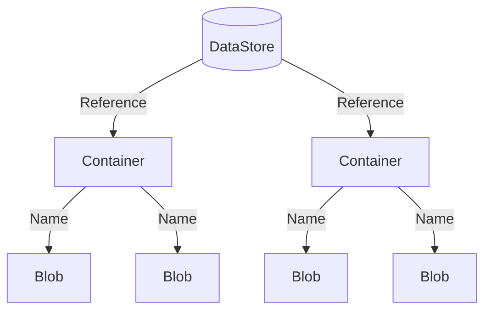

# Storing Experimental Data

Large experiments typically produce a large amount of data which must be organized and stored in some accessible way.
While you are certainly free to manage the data produced by the MOEA Framework in any manner, we also provide a
built-in storage solution called the **data store**.

## Introduction

A **data store** organizes content into **containers**, with each piece of data stored in a **blob**.  Containers are
uniquely identified by a **reference** and blobs by their **name**.  The diagram below shows this hierarchical
structure:



## Basic Usage

For this demonstration, we will create a data store backed by the file system.  Here, the content will be stored in the
`results/` directory.

<!-- java:test/org/moeaframework/snippet/DataStoreSnippet.java [datastore-create] -->

```java
DataStore dataStore = new FileSystemDataStore(new File("results"));
```

We access a container using a reference.  A reference contains one or more key-value pairs.  For example, below we
create a reference for `"populationSize"` set to `100`.

<!-- java:test/org/moeaframework/snippet/DataStoreSnippet.java [datastore-container] -->

```java
Reference reference = Reference.of("populationSize", 100);
Container container = dataStore.getContainer(reference);
```

Next, we can access blobs within the container by name.  Below, we create a blob named `"greeting"` and store the text
`"Hello world!"`.

<!-- java:test/org/moeaframework/snippet/DataStoreSnippet.java [datastore-blob] -->

```java
Blob blob = container.getBlob("greeting");
blob.storeText("Hello world!");

System.out.println(blob.extractText());
```

## File System Layout

Under the covers, the file system data store structures the content as folders and files.  If we were to look in the
`results/` folder, we would find the file structure:

> :file_folder: results/ <br/>
> &nbsp; &nbsp; &nbsp; :file_folder: populationSize/ <br/>
> &nbsp; &nbsp; &nbsp; &nbsp; &nbsp; &nbsp; :file_folder: 100/ <br/>
> &nbsp; &nbsp; &nbsp; &nbsp; &nbsp; &nbsp; &nbsp; &nbsp; &nbsp; :page_facing_up: greeting

Observe how the keys and values, in this case `populationSize` and `100`, form the folder hierarchy.  Suppose we
change the value to `200` and write the same blob:

<!-- java:test/org/moeaframework/snippet/DataStoreSnippet.java [datastore-layout] -->

```java
Reference reference = Reference.of("populationSize", 200);
Container container = dataStore.getContainer(reference);
```

We would see the following hierarchy:

> :file_folder: results/ <br/>
> &nbsp; &nbsp; &nbsp; :file_folder: populationSize/ <br/>
> &nbsp; &nbsp; &nbsp; &nbsp; &nbsp; &nbsp; :file_folder: 100/ <br/>
> &nbsp; &nbsp; &nbsp; &nbsp; &nbsp; &nbsp; &nbsp; &nbsp; &nbsp; :page_facing_up: greeting <br/>
> &nbsp; &nbsp; &nbsp; &nbsp; &nbsp; &nbsp; :file_folder: 200/ <br/>
> &nbsp; &nbsp; &nbsp; &nbsp; &nbsp; &nbsp; &nbsp; &nbsp; &nbsp; :page_facing_up: greeting

This layout also works with multiple key-value pairs, with each additional key-value pair producing nested folders.

## Storing Algorithm Results

Now let's look how the data store can integrate with the MOEA Framework by storing the results from an algorithm.
Here, we create a container based on the algorithm's unique configuration.

<!-- java:test/org/moeaframework/snippet/DataStoreSnippet.java [datastore-algorithm] -->

```java
Problem problem = new UF1();

NSGAII algorithm = new NSGAII(problem);
algorithm.run(10000);

Reference reference = Reference.of(algorithm.getConfiguration());
Container container = dataStore.getContainer(reference);

Blob blob = container.getBlob("result");
blob.storePopulation(algorithm.getResult());
```

But what happens if we run this code multiple times?  Each time, we will re-run the algorithm and overwrite the result
file.  We can improve upon this by first checking if the results exist before performing any expensive operations:

<!-- java:test/org/moeaframework/snippet/DataStoreSnippet.java [datastore-exists] -->

```java
if (!blob.exists()) {
    algorithm.run(10000);
    blob.storePopulation(algorithm.getResult());
}
```

One last point: while all of the properties defined by the algorithm's configuration are used to uniquely reference
its container, some run parameters including `seed` and `maxEvaluations` are not included in the configuration.  Instead,
we must modify the reference as follows:

<!-- java:test/org/moeaframework/snippet/DataStoreSnippet.java [datastore-seeds] -->

```java
for (int seed = 0; seed < 10; seed++) {
    PRNG.setSeed(seed);

    NSGAII algorithm = new NSGAII(problem);

    Reference reference = Reference.of(algorithm.getConfiguration()).with("seed", seed);
    Container container = dataStore.getContainer(reference);
    Blob blob = container.getBlob("result");

    if (!blob.exists()) {
        algorithm.run(10000);
        blob.storePopulation(algorithm.getResult());
    }
}
```

## Accessing Content

In the previous examples, we accessed containers and blobs through the programmatic interface.  We can also access
the content through the CLI or web server.

### CLI

The datastore and its containers and blobs can be referenced using a URI.  Below are some examples:

```
# The data store rooted at the path ./results/
file://results

# The container with attributes populationSize=100 and seed=1
file://results?populationSize=100&seed=1

# The blob named "greeting"
file://results?populationSize=100&seed=1#greeting
```

Using the `datastore` CLI tool, we can specify the URI along with an operation, such as listing the content of a
container or reading / writing a blob.

<!-- bash:.github/workflows/ci.yml [datastore] -->

```bash
# List contents of a container
./cli datastore list "file://results?populationSize=100&seed=1"

# Write to blob
echo "Hello world" | ./cli datastore set "file://results?populationSize=100&seed=1#greeting"

# Read from blob
./cli datastore get "file://results?populationSize=100&seed=1#greeting"
```

### Web Server

> [!WARNING]  
> The web server only supports unsecured (HTTP) connections.  Use caution when running the server on a
> publicly-accessible network.

The web server provides read-only access to the data store content.  First we start the server:

```bash
./cli datastore server "file://results"
```

The logging output will show the base URL to use when accessing the web server:

```
Configured data store at 127.0.0.1:8080/results
```

We can then query the contents using `curl` or through a browser.  Note we pass the blob name as the query parameter
`_name`.

```bash
# Check if the server is running
curl "127.0.0.1:8080/_health

# Request the contents of a container
curl "127.0.0.1:8080/results?populationSize=100&seed=1"

# Request the contents of a blob
curl "127.0.0.1:8080/results?populationSize=100&seed=1&_name=greeting"
```

When listing the contents of a data store or container, JSON text is returned.  For example, here is the output from
a container:

```
{
   "type":"container",
   "uri":"\/results?populationSize=100&seed=1",
   "reference":{
      "populationSize":"100",
      "seed":1
   },
   "blobs":[
      {
         "type":"blob",
         "name":"greeting",
         "uri":"\/results?populationSize=100&seed=1&_name=greeting"
      }
   ]
}
```
