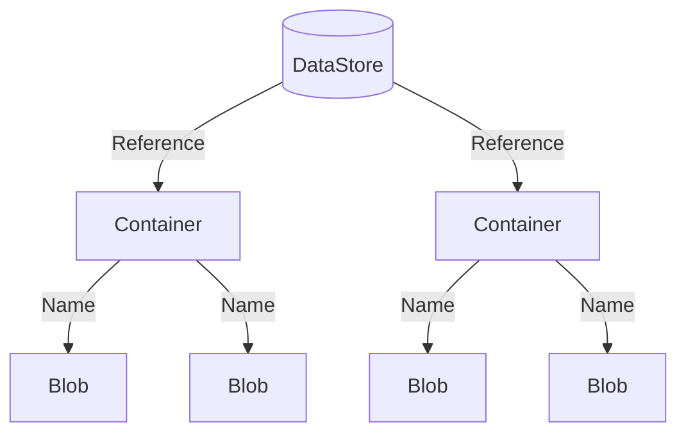

f# Storing Experimental Data

Large experiments typically produce a large amount of data which must be organized and stored in some accessible way.
While you are certainly free to manage the data produced by the MOEA Framework in any manner, we also provide a
built-in storage solution called the **data store**.

## Introduction

A **data store** organizes content into **containers**, with each piece of data stored in a **blob**.  Containers are
uniquely identified by a **reference** and blobs by their **name**.  The diagram below shows this hierarchical
structure:



## Basic Usage

For this demonstration, we will create a data store backed by the file system.  Here, the content will be stored in the
`results/` directory.

<!-- java:test/org/moeaframework/snippet/DataStoreSnippet.java [datastore-create] -->

```java
DataStore dataStore = new FileSystemDataStore(new File("results"));
```

We access a container using a reference.  A reference contains one or more key-value pairs.  For example, below we
create a reference for `"populationSize"` set to `100`.

<!-- java:test/org/moeaframework/snippet/DataStoreSnippet.java [datastore-container] -->

```java
Reference reference = Reference.of("populationSize", 100);
Container container = dataStore.getContainer(reference);
```

Changing the key, value, or both will reference a different container.  Next, we can access blobs within the container
by name.  Below, we create a blob named `"greeting"` and store the text `"Hello world!"`.

<!-- java:test/org/moeaframework/snippet/DataStoreSnippet.java [datastore-blob] -->

```java
Blob blob = container.getBlob("greeting");
blob.storeText("Hello world!");

System.out.println(blob.extractText());
```

## File System Layout

Under the covers, the file system data store structures the content as folders and files.  If we were to look in the
`results/` folder, we would find the file structure:

> :file_folder: results/ <br/>
> &nbsp; &nbsp; &nbsp; :file_folder: populationSize/ <br/>
> &nbsp; &nbsp; &nbsp; &nbsp; &nbsp; &nbsp; :file_folder: 100/ <br/>
> &nbsp; &nbsp; &nbsp; &nbsp; &nbsp; &nbsp; &nbsp; &nbsp; &nbsp; :page_facing_up: greeting

Observe how the keys and values, in this case `populationSize` and `100`, form the folder hierarchy.  Suppose we
change the value to `200` and write the same blob:

<!-- java:test/org/moeaframework/snippet/DataStoreSnippet.java [datastore-layout] -->

```java
Reference reference = Reference.of("populationSize", 200);
Container container = dataStore.getContainer(reference);
```

We would see the following hierarchy:

> :file_folder: results/ <br/>
> &nbsp; &nbsp; &nbsp; :file_folder: populationSize/ <br/>
> &nbsp; &nbsp; &nbsp; &nbsp; &nbsp; &nbsp; :file_folder: 100/ <br/>
> &nbsp; &nbsp; &nbsp; &nbsp; &nbsp; &nbsp; &nbsp; &nbsp; &nbsp; :page_facing_up: greeting <br/>
> &nbsp; &nbsp; &nbsp; &nbsp; &nbsp; &nbsp; :file_folder: 200/ <br/>
> &nbsp; &nbsp; &nbsp; &nbsp; &nbsp; &nbsp; &nbsp; &nbsp; &nbsp; :page_facing_up: greeting

This layout also works with multiple key-value pairs, with each additional key-value pair producing nested folders.

## Storing Algorithm Results

Now let's look how the data store can integrate with the MOEA Framework by storing the results from an algorithm.
Here, we create a container based on the algorithm's unique configuration.

<!-- java:test/org/moeaframework/snippet/DataStoreSnippet.java [datastore-algorithm] -->

```java
Problem problem = new UF1();

NSGAII algorithm = new NSGAII(problem);
algorithm.run(10000);

Reference reference = Reference.of(algorithm.getConfiguration());
Container container = dataStore.getContainer(reference);

Blob blob = container.getBlob("result");
blob.storePopulation(algorithm.getResult());
```

But what happens if we run this code multiple times?  Each time, we will re-run the algorithm and overwrite the result
file.  We can improve upon this by first checking if the results exist before performing any expensive operations:

<!-- java:test/org/moeaframework/snippet/DataStoreSnippet.java [datastore-exists] -->

```java
if (!blob.exists()) {
    algorithm.run(10000);
    blob.storePopulation(algorithm.getResult());
}
```

One last point: while all of the properties defined by the algorithm's configuration are used to uniquely reference
its container, some run parameters including `seed` and `maxEvaluations` are not included in the configuration.  Instead,
we must modify the reference as follows:

<!-- java:test/org/moeaframework/snippet/DataStoreSnippet.java [datastore-seeds] -->

```java
for (int seed = 0; seed < 10; seed++) {
    PRNG.setSeed(seed);

    NSGAII algorithm = new NSGAII(problem);

    Reference reference = Reference.of(algorithm.getConfiguration()).with("seed", seed);
    Container container = dataStore.getContainer(reference);
    Blob blob = container.getBlob("result");

    if (!blob.exists()) {
        algorithm.run(10000);
        blob.storePopulation(algorithm.getResult());
    }
}
```

## Referencing and Accessing Content

In the previous examples, we used accessed containers and blobs through the programmatic interface.  The data store and
its contents can alternatively be referenced by a URI.  For instance, here we get the URI for a blob, then resolve that
same blob using the URI:

<!-- java:test/org/moeaframework/snippet/DataStoreSnippet.java [datastore-geturi] -->

```java
URI uri = blob.getURI();
```

For the file system data store, the URI will look similar to:

```
file://results?populationSize=100&seed=1#result
```

Observe how the query section specifies the key-value pairs and the fragment (the part after `#`) specifies the blob
name.  We can also use these URIs to access the data store via the command line:

<!-- bash:.github/workflows/ci.yml [datastore] -->

```bash
# List contents of a container
./cli datastore --uri "file://results?populationSize=100&seed=1" --list

# Write to blob
echo "Hello world" | ./cli datastore --uri "file://results?populationSize=100&seed=1#greeting --set"

# Get blob
./cli datastore --uri "file://results?populationSize=100&seed=1#result" --get
```

Lastly, we can start a simple HTTP server that provides read-only access to the data store over a network:

<!-- bash:.github/workflows/ci.yml [datastore-server] -->

```bash
# Start server
./cli datastore --uri "file://results" --server &

# Request the contents of a container
curl "127.0.0.1:8080/results?populationSize=100&seed=1"

# Request the contents of a blob
curl "127.0.0.1:8080/results?populationSize=100&seed=1&__name=greeting"
```

Below we see the list of blobs in the container:

```
{
   "type":"container",
   "url":"\/results?populationSize=100&seed=1",
   "reference":{
      "populationSize":"100",
      "seed":1
   },
   "blobs":[
      {
         "type":"blob",
         "name":"greeting",
         "url":"\/results?populationSize=100&seed=1&__name=greeting"
      }
   ]
}
```

> [!WARNING]  
> The HTTP server only supports unsecured connections.  Use caution when running the server on a publicly-accessible
> network.
