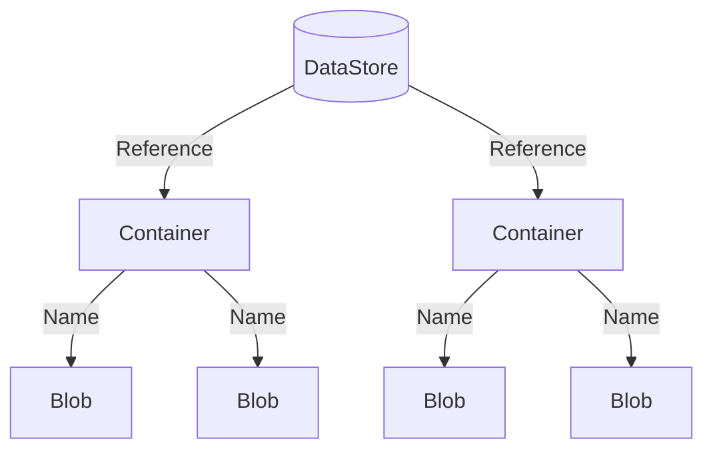

# Storing Experimental Data

Large experiments typically produce a large amount of data which must be organized and stored in some accessible way.
While you are certainly free to manage the data produced by the MOEA Framework in any manner, we also provide a
built-in storage solution called the **data store**.

## Introduction

A **data store** organizes content into **containers**, with each piece of data stored in a **blob**.  Containers are
uniquely identified by a **reference** and blobs by their **name**.  The diagram below shows this hierarchical
structure:



These names are intentional to abstract the programmatic interfaces from their underlying representation.  By default,
we provide a file storage backend, where containers are mapped to folders and blobs to files, but the backend could
easily be replaced by a database or cloud storage.

## Basic Usage

For this demonstration, we will create a data store backed by the file system.  Here, the content will be stored in the
`results/` directory.

<!-- java:test/org/moeaframework/snippet/DataStoreSnippet.java [datastore-create] -->

```java
DataStore dataStore = new FileSystemDataStore(new File("results"));
```

We access a container using a reference.  A reference contains one or more key-value pairs.  For example, below we
create a reference for `"populationSize"` set to `100`.

<!-- java:test/org/moeaframework/snippet/DataStoreSnippet.java [datastore-container] -->

```java
Reference reference = Reference.of("populationSize", 100);
Container container = dataStore.getContainer(reference);
```

If we change `100` to a different value, it would reference a different container.  Next, we can access blobs within
the container by name.  Below, we create a blob named `"greeting"` and store the text `"Hello world!"`.

<!-- java:test/org/moeaframework/snippet/DataStoreSnippet.java [datastore-blob] -->

```java
Blob blob = container.getBlob("greeting");
blob.storeText("Hello world!");

System.out.println(blob.extractText());
```

## File System Layout

Under the covers, the file system data store structures the content as folders and files.  If we were to look in the
`results/` folder, we would find the file structure:

> :file_folder: results/ <br/>
> &nbsp; &nbsp; &nbsp; :file_folder: populationSize/ <br/>
> &nbsp; &nbsp; &nbsp; &nbsp; &nbsp; &nbsp; :file_folder: 100/ <br/>
> &nbsp; &nbsp; &nbsp; &nbsp; &nbsp; &nbsp; &nbsp; &nbsp; &nbsp; :page_facing_up: greeting

Observe how the keys, in this case `"populationSize"`, and the values, `100`, form the folder hierarchy.  Suppose we
change the value to `200` and write the same blob:

<!-- java:test/org/moeaframework/snippet/DataStoreSnippet.java [datastore-layout] -->

```java
Reference reference = Reference.of("populationSize", 200);
Container container = dataStore.getContainer(reference);
```

We would see the following hierarchy:

> :file_folder: results/ <br/>
> &nbsp; &nbsp; &nbsp; :file_folder: populationSize/ <br/>
> &nbsp; &nbsp; &nbsp; &nbsp; &nbsp; &nbsp; :file_folder: 100/ <br/>
> &nbsp; &nbsp; &nbsp; &nbsp; &nbsp; &nbsp; &nbsp; &nbsp; &nbsp; :page_facing_up: greeting
> &nbsp; &nbsp; &nbsp; &nbsp; &nbsp; &nbsp; :file_folder: 200/ <br/>
> &nbsp; &nbsp; &nbsp; &nbsp; &nbsp; &nbsp; &nbsp; &nbsp; &nbsp; :page_facing_up: greeting

This layout also works with multiple key-value pairs, with the folder hierarchy structured accordingly.

## Storing Algorithm Results

Now let's look how the data store can integrate with the MOEA Framework by storing the results from an algorithm.
Here, we create a container based on the algorithm's unique configuration.

<!-- java:test/org/moeaframework/snippet/DataStoreSnippet.java [datastore-algorithm] -->

```java
Problem problem = new UF1();

NSGAII algorithm = new NSGAII(problem);
algorithm.run(10000);

Reference reference = Reference.of(algorithm.getConfiguration());
Container container = dataStore.getContainer(reference);

Blob blob = container.getBlob("result");
blob.storePopulation(algorithm.getResult());
```

> [!TIP]
> Some run parameters are not stored in the algorithm's configuration, such as the `seed` or `maxEvaluations`.
> Use the `with(...)` method to include such parameters in the reference, such as `reference.with("maxEvaluations", 10000)`.

## Persistent Storage

Perhaps the most useful feature of the data store is for persistent storage, where we can check if the output was
previously saved and, if so, avoid recomputing the result.

<!-- java:test/org/moeaframework/snippet/DataStoreSnippet.java [datastore-exists] -->

```java
Problem problem = new UF1();
NSGAII algorithm = new NSGAII(problem);

Reference reference = Reference.of(algorithm.getConfiguration());
Container container = dataStore.getContainer(reference);
Blob blob = container.getBlob("result");

if (!blob.exists()) {
    algorithm.run(10000);
    blob.storePopulation(algorithm.getResult());
}
```


