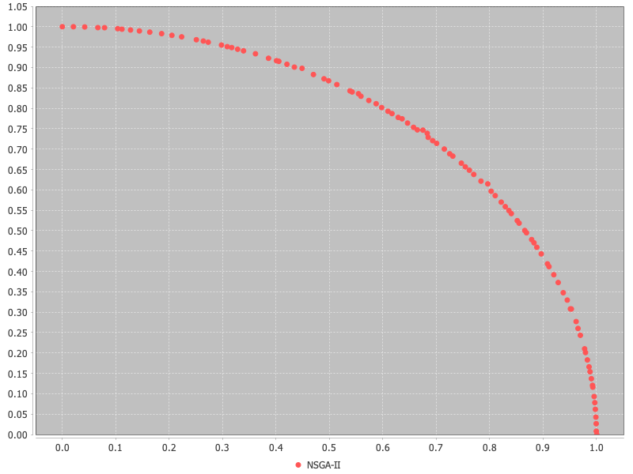

# An Example

Let's create and solve the 2-dimension DTLZ2 test problem using NSGA-II:

<!-- java:examples/Example1.java [29:34] -->

```java
Problem problem = new DTLZ2(2);

NSGAII algorithm = new NSGAII(problem);
algorithm.run(10000);

algorithm.getResult().display();
```

The last line gets the Pareto non-dominated solutions to the problem and displays them in the terminal.

<!-- output:examples/Example1.java [:7] {Truncated} -->

```
Var1     Var2     Var3     Var4     Var5     Var6     Var7     Var8     Var9     Var10    Var11    Obj1     Obj2
-------- -------- -------- -------- -------- -------- -------- -------- -------- -------- -------- -------- --------
1.000000 0.500094 0.505473 0.502753 0.500365 0.499805 0.500569 0.496846 0.503417 0.500038 0.501108 0.000000 1.000061
0.000000 0.497015 0.523063 0.490592 0.485922 0.497590 0.505783 0.496919 0.504620 0.502227 0.506841 1.000949 0.000000
0.242941 0.486582 0.498399 0.510138 0.518632 0.499523 0.501980 0.504977 0.503947 0.499732 0.501241 0.928696 0.372669
0.178412 0.513125 0.503748 0.492867 0.499933 0.500295 0.502367 0.494850 0.468585 0.501130 0.508556 0.962265 0.276964
0.256213 0.496450 0.504902 0.490998 0.498558 0.511593 0.502198 0.496751 0.505202 0.500039 0.508656 0.920442 0.391828
...
```

Alternatively, we can create a 2D plot showing the results:

<!-- java:examples/Example2.java [36:38] -->

```java
new Plot()
    .add("NSGA-II", algorithm.getResult())
    .show();
```



## Performance indicators

We can also measure the quality of the resulting Pareto non-dominated solutions using one or more performance
indicators, such as Hypervolume.  Below we construct an `Indicators` class with the known reference set for the
DTLZ2 problem, then calculate and display the performance indicator values:

<!-- java:examples/Example3.java [42:46] -->

```java
NondominatedPopulation referenceSet = NondominatedPopulation.load("pf/DTLZ2.2D.pf");
Indicators indicators = Indicators.all(problem, referenceSet);

IndicatorValues indicatorValues = indicators.apply(algorithm.getResult());
indicatorValues.display();
```

<!-- output:examples/Example3.java -->

```
Indicator                        Value
-------------------------------- --------
Hypervolume                      0.209256
GenerationalDistance             0.001027
GenerationalDistancePlus         0.002517
InvertedGenerationalDistance     0.004491
InvertedGenerationalDistancePlus 0.002956
AdditiveEpsilonIndicator         0.010052
Spacing                          0.005918
MaximumParetoFrontError          0.042614
Contribution                     0.000000
R1Indicator                      0.446108
R2Indicator                      0.000276
R3Indicator                      0.000419
```

## Configuring Algorithms

While this looks simple, there is a lot going on behind the scenes.  When we create a new instance of the NSGA-II
algorithm, it inspects the problem to determine its type and supplies the recommended variation operators and
parameters.  In this example, since the problem is real-valued, it will use Simulated Binary Crossover (SBX) and
Polynomial Mutation (PM).  We can confirm this by viewing the configuration:

<!-- java:examples/Example4.java [34:34] -->

```java
algorithm.getConfiguration().display();
```

<!-- output:examples/Example4.java -->

```
Property              Value
--------------------- -------------------
algorithm             NSGA-II
operator              sbx+pm
pm.distributionIndex  20.0
pm.rate               0.09090909090909091
populationSize        100
problem               DTLZ2_2
sbx.distributionIndex 15.0
sbx.rate              1.0
sbx.swap              true
sbx.symmetric         false
```

What if we want to run this algorithm with a different configuration?  We can simply call the setter methods.
Here we change the initial population size and set the variation operator to Parent Centric Crossover (PCX):

<!-- java:examples/Example5.java [34:36] -->

```java
NSGAII algorithm = new NSGAII(problem);
algorithm.setInitialPopulationSize(250);
algorithm.setVariation(new PCX(5, 2));
```

Alternatively, similar to how we read the current configuration with `getConfiguration`, we can apply
different settings with `applyConfiguration`.  For example, the following results in the same setup
as the previous example:

<!-- java:examples/Example6.java [36:42] -->

```java
TypedProperties properties = new TypedProperties();
properties.setInt("populationSize", 250);
properties.setString("operator", "pcx");
properties.setInt("pcx.parents", 10);
properties.setInt("pcx.offspring", 2);

algorithm.applyConfiguration(properties);
```
