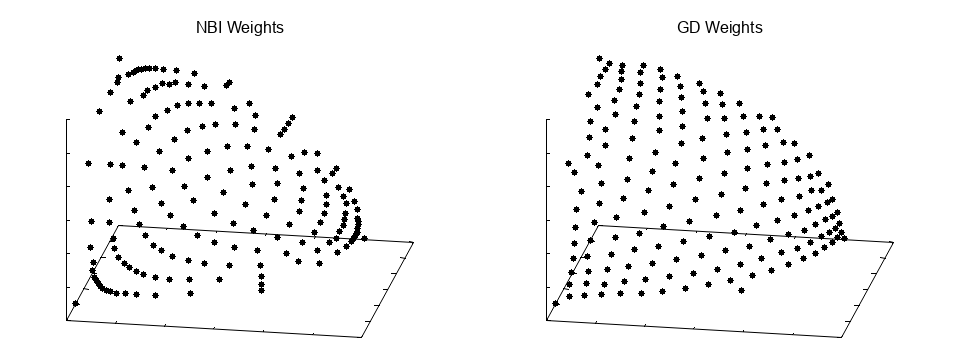

# MOEA/D and Generalized Decomposition

## MOEA/D

MOEA/D is a popular multi-objective optimization algorithm that decomposes a multi-objective problem into many
single-objective subproblems, optimizing these subproblems simultaneously to approximate the Pareto front.  Commonly,
the Chebyshev (aka Tchebycheff) scalarizing function is used:

$$ g(x) = \text{max}_i \left( w_i \left| f_i(x) - z_i^* \right| \right) $$

where $$x$$ represents the decision variables, $$f_i(x)$$ is the i-th objective function, $$w$$ is the weight vector,
and $$z^*$$ is the ideal objective vector.  Each subproblem uses a different set of weights, and solutions with smaller
values for $$g(x)$$ are selected for survival with respect to each subproblem.

## What is Generalized Decomposition?

One limitation of such scalarizing functions is the weights do not directly correspond to locations on the Pareto
front.  In practice, using uniformly-distributed weights does not typically produce a uniformly-distributed Pareto
front, instead resulting in some regions with a higher concentration of points and others lacking coverage.

Generalized decomposition (GD) is a method to overcome this limitation.  We start with a set of target points that
define the ideal distribution of points on the Pareto front, then solve the inverse of the Chebychev scalarizing
function to find the weights corresponding to those points.  Without loss of generality, let's assume that
$$f(x) \geq 0$$ so we can ignore the $$z^*$$ term.  Then, we find the weights, $$w$$, by solving:

$$
\begin{align}
\text{Minimize } &\lVert w * f(x) \rVert_\infty \\\
\text{Subject to } &\text{sum}(w) = 1 \\\
&0 \leq w \leq 1
\end{align}
$$

We can convert $$\lVert w * f(x) \rVert_\infty$$ into linear constraints by introducing the slack variable $$t$$ as
follows:

$$
\begin{align}
\text{Minimize } &t \\\
\text{Subject to } &\text{sum}(w) = 1 \\\
&0 \leq w \leq 1 \\\
&w * f(x) <= t \\\
&w * f(x) >= -t
\end{align}
$$

This formulation is a linear program (LP) which can be solved efficiently using the primal-dual interior point method.
For more details on the GD procedure, please refer to:

> Giagkiozis, I., R. C. Purshouse, and P. J. Fleming (2013).  "Generalized Decomposition."  Evolutionary Multi-Criterion Optimization, 7th International Conference, pp. 428-442.

## Prerequisites

Since GD involves solving a convex optimization problem, we require the Python `cvxopt` library.  Therefore, please
ensure Python 3 and `cvxopt` are installed:

```
pip install cvxopt
```

## Example

We begin by generating the set of target points.  Here, we use the Normal Boundary Intersection (NBI) method to produce
a set of well-distributed points.  Note that the `--dimensions` parameter must match the number of objectives:

<!-- bash:examples/org/moeaframework/examples/generalizedDecomposition/generateWeights.sh [3:3] -->

```bash
./cli SequenceGenerator --weights normalboundary --dimension 3 --divisions 20 > nbi_weights.txt
```

Then, for each target point we use GD to generate the corresponding weights:

<!-- bash:examples/org/moeaframework/examples/generalizedDecomposition/generateWeights.sh [4:4] -->

```bash
cat nbi_weights.txt | python3 examples/org/moeaframework/examples/generalizedDecomposition/gd.py > gd_weights.txt
```

Finally, we can supply these weights to MOEA/D:

<!-- java:examples/org/moeaframework/examples/generalizedDecomposition/GeneralizedDecompositionExample.java [59:64] -->

```java
FixedWeights weights = FixedWeights.load(new File("gd_weights.txt"));

MOEAD algorithm = new MOEAD(problem);
algorithm.setWeightGenerator(weights);
algorithm.setInitialPopulationSize(weights.size());
algorithm.run(10000);
```

Comparing the hypervolume, we see GD outperform NBI weights:

```
Name         Min      Median   Max      IQR (+/-) Count Statistically Similar (a=0.05)
------------ -------- -------- -------- --------- ----- ------------------------------
MOEA/D (GD)  0.409812 0.413551 0.417779 0.002444  50
MOEA/D (NBI) 0.401969 0.405872 0.410604 0.002854  50
```

The difference is also visually striking when plotting the results.  Observe how NBI weights (left) tend to form
clusters near the "steeper" parts of the Pareto front, whereas the GD weights (right) are more uniformly distributed.


