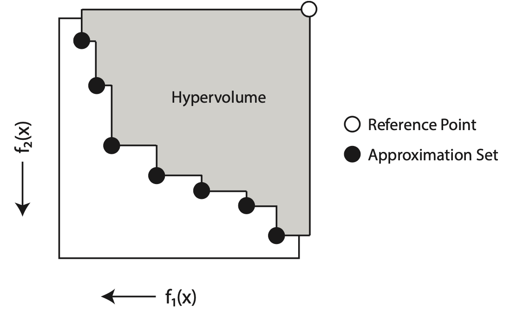

# Intro to Multiobjective Optimization

## Single-Objective Optimization

Let's begin by formalizing a single-objective optimization problem:

$$
\begin{align}
\min_{x \in X} &f(x) & \\\
\text{s.t. } &g_i(x) \leq 0, &i = 1, \ldots, m \\\
&h_j(x) = 0, &j = 1, \ldots, p
\end{align}
$$

where

* $f(x): \mathbb{R}^n \rightarrow \mathbb{R}$ is the **objective function** being minimized over the search space $X \subseteq \mathbb{R}^n$,
* $g_i(x)$ are **inequality** constraints, and
* $h_j(x)$ are **equality** constraints.

The solution $x^\*$ that minimizes the function $f(x)$ is called the **optimal solution**.  Note that $x^\*$ is not
necessarily unique, as multiple distinct solutions could satisfy these criteria.  This is especially true when $f(x)$
is a non-linear, multi-modal function.

> [!NOTE]
> This formulation is called the "standard form" of the optimization problem.  Observe that we can convert a problem to this
> standard form by rewriting the expressions.  For instance, we can convert a maximization problem into minimization by
> negating the objective function.

## Multi-objective Optimization

Multi-objective optimization extends this formulation by defining two or more objective functions:

$$
\min_{x \in X} \left( f_1(x), f_2(x), \ldots, f_k(x) \right)
$$

We need to be careful when defining optimality for a multi-objective problem.  While in some problem formulations it's
possible to minimize each objective function independently, more likley than not there exist tradeoffs between the objectives.
That is, trying to improve the value of one (or more) objectives results in a loss or degredation in other objectives.
Consequently, there is typically no singular optimal solution.

This concept of tradeoffs is known as **Pareto efficiency** or **Pareto dominance**, named after economist and
civil engineer Vilfredo Pareto.  Formally, a solution $x_1$ is said to Pareto dominate $x_2$, denoted by $x_1 \prec x_2$, if:

$$
\begin{align}
\forall i \in \left{ 1, 2, \ldots, k \right}, &f_i(x_1) \leq f_i(x_2) \\\
\exists j \in \left{ 1, 2, \ldots, k \right}, &f_j(x_1) < f_j(x_2)
\end{align}
$$

In other words, a solution Pareto dominates another if it is not worse in any objective and better in at least one.  We can
then extend the idea of optimality using Pareto dominance, such that a solution $x^\*$ is **Pareto optimal** if no other
feasible solutions exist that dominate it.  The set of Pareto optimal solutions is known as the **Pareto front**.

Since tradeoffs typically exist between objectives, the Pareto front typically contains multiple solutions.  Since these
solutions, by definition, do not dominate each other, we say they are **non-dominated**.  Formally, two solutions are
non-dominated if $x_1 \nprec x_2$ and $x_2 \nprec x_1$.

## Optimization Algorithms and Metaheuristics

An optimization algorithm is a procedure used to identify the optimal solutions to a given optimization problem.  Optimization
algorithms come in many different flavors depending on the properties of the problem.  Linear programming, convex
optimization, non-linear programming, combinatorial optimization, etc., are all forms of classical optimization algorithms.
While the specifics of these approaches is out of scope, we do highlight that these algorithms routinely provide some
guarantee or proof of finding an optimal solution within some finite time complexity.

Metaheuristics, on the other hand, are higher-level procedures for finding the optimum or a close approximation thereof,
that make few or no assumptions on the structure of the problem.  A consequence of these relaxed requirements is an
inability to guarantee finding the globally optimal solution, though in practice metaheuristics perform reasonably well.

One class of metaheuristics, known as **evolutionary algorithms**, use procedures inspired by nature and natural selection
to drive search.  For instance, **genetic algorithms** are based on the idea of evolving a population of individuals,
where the decision variables are encoded in the "genetics" of each individual and traits are passed on to offspring
during mating / recombination.  This is depicted below, showing the repeated application of selection, recombination,
and survival, as the population evolves towards better and better solutions.

	

When applied to a multi-objective problem, we refer to these algorithms as **multi-objective evolutionary algorithms**
or **MOEAs**.

## Scalarizing Functions and Decomposition

Early attempts at constructing MOEAs involved translating the multi-objective problem into a single-objective
formulation, using a process called **scalarization**.  Two commonly-used scalarizing functions are linear weights:

$$ F_{\text{linear}}(x) = \sum_{i = 1}^k \lambda_i * \left| f_i(x) - z_i^\* \right| $$

and the Chebyshev or Tchebycheff method:

$$ F_{\text{chebyshev}}(x) = \max_{i \in \left{ 1, \ldots, k \right} } \lambda_i * \left| f_i(x) - z_i^\* \right| $$

where $z^\*$ is the ideal point, though for simplicity we often assume $z^\* = 0$.  One key distinction between these two
approaches is linear weights are unable to enumerate all Pareto optimal solutions when the Pareto front is non-convex,
regardless of what weights are provided.

The simplest approach at solving a multi-objective problem using scalarizing functions is supplying a single weight
vector and using the identified solution.  This, of course, assumes the weight is representative of the desired
solution, though in practice it is non-trivial to select such weights (see [Generalized Decomposition](generalizedDecomposition.md).

Alternatively, we can sample a large number of weights, repeatedly solving the resulting single-objective formulation.
This approach, known as Repeated Single Objective (RSO), is capable of producing the Pareto front, but can be
computationally expensive.

Decomposition approaches combine this idea of sampling many weights with population-based evolutionary algorithms by
associating a weight vector with each member of the population.  During the survival / replacement phase, the offspring
producing the best value for each weight vector survives to the following generation.  This concept is used by the
population MOEA/D algorithm.

## Quality Indicators

The output from an MOEA is a collection of the feasible, Pareto optimal solutions found during optimization, called the
**approximation set**.  We can collect these approximation sets and compare them across different MOEAs to quantify their
relative performance.  We use **quality indicators** to quantify the quality of an approximation set as a single,
numerical value.  One such indicator is **hypervolume**.  Hypervolume measures the volume of space dominated by the
approximation set, as depicted below:

	

We assume for the sake of this example that the objectives are minimized, with the ideal point at the lower-left
corner.  We can see that, as the points in the Pareto front move closer to the lower-left corner, the hypervolume tends
to increase.

A variety of quality indicators exist that measure different characteristics of the Pareto front, such as convergence,
spread, and uniformity.  When considering convergence, one important property is **Pareto compliance**.  We say a 
quality indicator, $\mathcal{I}$, is Pareto compliant if  

$$ A \prec B \rightarrow \mathcal{I}(A) \lt \mathcal{I}(B) $$

where $A \prec B$ represents "strict dominance", meaning every solution in $B$ is either equal to or dominated by a
solution in $A$.  This property is useful when comparing the numeric output of a quality indicator, since a better
value implies Pareto dominance.  Nevertheless, even those indicators which are not Pareto compliant can be useful when
comparing specific traits of approximation sets.
