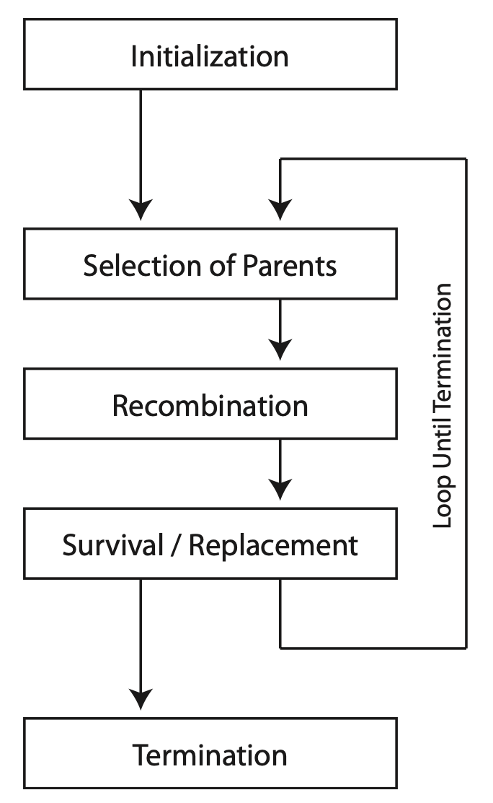

# Intro to Multiobjective Optimization

## Single-Objective Optimization

Let's begin by formalizing a single-objective optimization problem:

$$
\begin{align}
\min_{x \in X} &f(x) & \\\
\text{s.t. } &g_i(x) \leq 0, &i = 1, \ldots, m \\\
&h_j(x) = 0, &j = 1, \ldots, p
\end{align}
$$

where

* $f(x): \mathbb{R}^n \rightarrow \mathbb{R}$ is the **objective function** being minimized over the search space $X \subseteq \mathbb{R}^n$,
* $g_i(x)$ are **inequality** constraints, and
* $h_j(x)$ are **equality** constraints.

The solution $x^\*$ that minimizes the function $f(x)$ is called the **optimal solution**.  Note that $x^\*$ is not
necessarily unique, as multiple distinct solutions could satisfy these criteria.  This is especially true when $f(x)$
is a non-linear, multi-modal function.

> [!NOTE]
> This formulation is called the "standard form" of the optimization problem.  Observe that we can convert a problem to this
> standard form by rewriting the expressions.  For instance, we can convert a maximization problem into minimization by
> negating the objective function.

## Multi-objective Optimization

Multi-objective optimization extends this formulation by defining two or more objective functions:

$$
\min_{x \in X} \left( f_1(x), f_2(x), \ldots, f_k(x) \right)
$$

We need to be careful when defining optimality for a multi-objective problem.  While in some problem formulations it's
possible to minimize each objective function independently, more likley than not there exist tradeoffs between the objectives.
That is, trying to improve the value of one (or more) objectives results in a loss or degredation in other objectives.
Consequently, there is typically no singular optimal solution.

This concept of tradeoffs is known as **Pareto efficiency** or **Pareto dominance**, named after economist and
civil engineer Vilfredo Pareto.  Formally, a solution $x_1$ is said to Pareto dominate $x_2$, denoted by $x_1 \prec x_2$, if:

$$
\begin{align}
\forall i \in {1, 2, \ldots, k}, &f_i(x_1) \leq f_i(x_2) \\\
\exists j \in {1, 2, \ldots, k}, &f_j(x_1) < f_j(x_2)
\end{align}
$$

In other words, a solution Pareto dominates another if it is not worse in any objective and better in at least one.  We can
then extend the idea of optimality using Pareto dominance, such that a solution $x^\*$ is **Pareto optimal** if no other
feasible solutions exist that dominate it.  The set of Pareto optimal solutions is known as the **Pareto front**.

Since tradeoffs typically exist between objectives, the Pareto front typically contains multiple solutions.  Since these
solutions, by definition, do not dominate each other, we say they are **non-dominated**.  Formally, two solutions are
non-dominated if $x_1 \nprec x_2$ and $x_2 \nprec x_1$.

## Optimization Algorithms and Metaheuristics

An optimization algorithm is a procedure used to identify the optimal solutions to a given optimization problem.  Optimization
algorithms come in many different flavors depending on the properties of the problem.  Linear programming, convex
optimization, non-linear programming, combinatorial optimization, etc., are all forms of classical optimization algorithms.
While the specifics of these approaches is out of scope, we do highlight that these algorithms typically provide some
guarantee or proof of finding an optimal solution within some finite time-complexity.

Metaheuristics, on the other hand, is a higher-level procedure for finding the optimum or a close approximation thereof,
that make few or no assumptions on the structure of the problem.  A consequence of these relaxed requirements is an
inability to guarantee finding the globally optimal solution, though in practice metaheuristics perform reasonably well.

One class of metaheuristics, known as **evolutionary algorithms**, use procedures inspired by nature and natural selection
to find the optimum.  For instance, **genetic algorithms** are based on the idea of evolving a population of individuals,
each representing a potential solution to the problem with its genetic code, whereby individuals mate to produce offspring.
Some form of selection pressure is applied to retain more fit individuals in the population.  This is depicted below, where
this process of selection, recombination, and survival repeat, evolving the population towards better and better solutions.

When applied to a multi-objective problem, we refer to these algorithms as **multi-objective evolutionary algorithms**
or **MOEAs**.

## Measuring Performance

The output from an MOEA is a collection of the feasible, Pareto optimal solutions found during optimization, called the
**approximation set**.  We can collect these approximation sets and compare them across different MOEAs to quantify their
relative performance.  But how to we measure the quality of a set of points?  Several standard indicators have been devised,
including hypervolume, generational distance, inverted generational distance, spacing, additive $\epsilon$-indicator, etc.
To the sake of brevity, we will just discuss hypervolume.