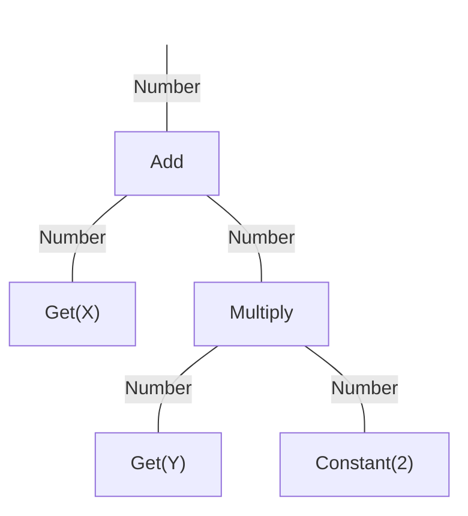

# Decision Variables

A `Solution` consists of one or more decision variables.  All decision variables derive from the `Variable`
interface.  There are a number of built-in decision variable types along with
[mutation and crossover operators](listOfOperators.md) for evolving those types.

For convenience, we also provide an `EncodingUtils` class that handles creating, reading, and writing values to
decision variables.  It makes converting between native Java types and decision variables easy.

## Real

Real-valued decision variables store numbers between some lower and upper bounds.  Internally these are represented as
double precision (64-bit) floating point values.

<!-- java:test/org/moeaframework/snippet/VariableSnippet.java [36:45] {keepComments} -->

```java
// Creating a real-valued variable:
solution.setVariable(i, EncodingUtils.newReal(lowerBound, upperBound));

// Reading and writing a single variable:
double value = EncodingUtils.getReal(solution.getVariable(i));
EncodingUtils.setReal(solution.getVariable(i), value);

// Reading and writing all variables (when all variables in the solution are real-valued):
double[] values = EncodingUtils.getReal(solution);
EncodingUtils.setReal(solution, values);
```

## Binary

Binary decision variables represent a bit string of a fixed length.  Each bit has the value `0` or `1` (or `false`
and `true`).  In Java, you can read the value either as a `boolean[]` or using a `BitSet`.

<!-- java:test/org/moeaframework/snippet/VariableSnippet.java [54:62] {keepComments} -->

```java
// Creating a binary variable:
solution.setVariable(i, EncodingUtils.newBinary(length));

// Reading the values as an array or BitSet:
boolean[] bits = EncodingUtils.getBinary(solution.getVariable(i));
BitSet bitSet = EncodingUtils.getBitSet(solution.getVariable(i));

// Updating the bits:
EncodingUtils.setBinary(solution.getVariable(i), bits);
```

## Integer

Integers can be represented internally using either the real or binary encoding.  The choice of encoding affects what
operators are available.  We generally recommend using binary.  By default, the binary representation uses
[Gray code](https://en.wikipedia.org/wiki/Gray_code) to ensure a single bit flip can produce an adjacent integer
(`X-1` or `X+1`).

<!-- java:test/org/moeaframework/snippet/VariableSnippet.java [72:82] {keepComments} -->

```java
// Creating an integer variable:
solution.setVariable(i, EncodingUtils.newInt(lowerBound, upperBound));
solution.setVariable(i, EncodingUtils.newBinaryInt(lowerBound, upperBound));

// Reading and writing a single variable:
int value = EncodingUtils.getInt(solution.getVariable(i));
EncodingUtils.setInt(solution.getVariable(i), value);

// Reading and writing all variables (when all variables in the solution are integers):
int[] values = EncodingUtils.getInt(solution);
EncodingUtils.setInt(solution, values);
```

## Permutation

A permutation is a fixed-length array of numbers $N$ numbers, from $0, ..., N-1$.  The ordering of values in the array
is important.  Additionally, each value can appear in the permutation exactly once.  For example, permutations are
used by the Traveling Salesman Problem to specify the order that cities are visited.

<!-- java:test/org/moeaframework/snippet/VariableSnippet.java [91:96] {keepComments} -->

```java
// Creating a permutation:
solution.setVariable(i, EncodingUtils.newPermutation(length));

// Reading and writing a permutation:
int[] permutation = EncodingUtils.getPermutation(solution.getVariable(i));
EncodingUtils.setPermutation(solution.getVariable(i), permutation);
```

## Subset

A subset represents a fixed set of $K$ elements or a variable-length set of between $L$ and $U$ possible elements.
Additionally, the set can contain $M$ possible elements, ranging from $0, ..., M-1$.  Each element can appear *at most*
once, but the order of the elements does not matter.

Subsets and binary encodings can serve similar purposes, as we can interpret the bit values of `0` and `1` as
membership in the set.  A binary string of length $N$ is equivalent to a variable-length subset containing between $0$
and $N$ elements.  However, the primary difference is a subset can specify the minimum, $L$, and maximum, $U$, number
of elements in a valid subset.

<!-- java:test/org/moeaframework/snippet/VariableSnippet.java [108:114] {keepComments} -->

```java
// Creating a fixed and variable-length subset:
solution.setVariable(i, EncodingUtils.newSubset(fixedSize, numberOfElements));
solution.setVariable(i, EncodingUtils.newSubset(minSize, maxSize, numberOfElements));

// Reading and writing the sets
int[] subset = EncodingUtils.getSubset(solution.getVariable(i));
EncodingUtils.setSubset(solution.getVariable(i), subset);
```

## Program

The program type is useful when generating computer code, rule systems, or decision trees.  The MOEA Framework has a
strongly-typed programming language built into it that can generate and evaluate such programs.

It works by constructing a program tree, where each leaf in the tree is a "node".  A node represents some operation,
like a function, with some number of inputs and an output.  Furthermore, each input and output is typed.  For example,
the `Add` node takes two inputs, both numbers, and produces as output another number.  These types determine how
connections can be formed between nodes.



Check out the code samples in [/examples/org/moeaframework/examples/gp](../examples/org/moeaframework/examples/gp).

## Grammar

The grammar type facilitates grammatical evolution.  This is similar in functionality to programs, except it used a
context-free grammar given in [Backus-Naur form](https://en.wikipedia.org/wiki/Backus%E2%80%93Naur_form).  For example,
the following grammar specification:

<!-- text:examples/org/moeaframework/examples/ge/regression/grammar.bnf -->

```text
<expr> ::= <func> | (<expr> <op> <expr>) | <value>
<func> ::= <func-name> ( <expr> )
<func-name> ::= Math.sin | Math.cos | Math.exp | Math.log
<op> ::= + | * | - | /
<value> ::= x
```

would generate statements like `sin(x) + cos(x)`, `log(x / y)`, `y - x`, etc.  However, unlike a program, a
grammar can generate arbitrary statements, not necessarily just executable programs.

Regardless of what statements the grammar produces, one then needs a way to "evaluate" the program in terms of fitness.
For executable programs, the statement can be fed into a scripting language, including any of
[Java's supported scripting languages](https://objectcomputing.com/resources/publications/sett/march-2001-scripting-languages-for-java).
Find code samples in [/examples/org/moeaframework/examples/ge](../examples/org/moeaframework/examples/ge).
