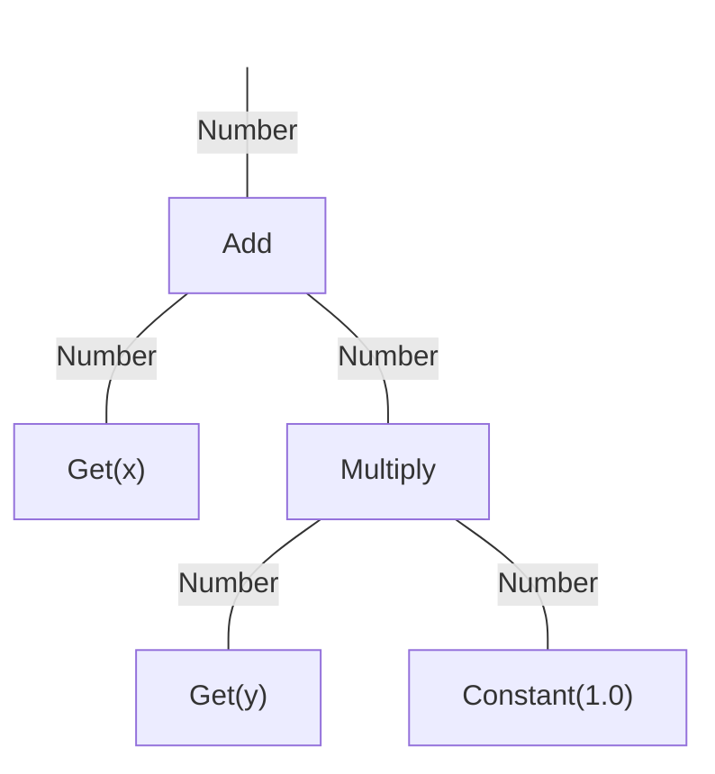

# Decision Variables

A `Solution` consists of one or more decision variables.  All decision variables derive from the `Variable`
interface.  There are a number of built-in decision variable types along with
[mutation and crossover operators](listOfOperators.md) for evolving those types.

To read the value stored in a variable, you must first cast it to the specific type.  For convenience, each variable
defines static methods for reading and writing the values, as demonstrated in the examples below.

## Real

Real-valued decision variables store numbers between some lower and upper bounds.  Internally these are represented as
double precision (64-bit) floating point values.

<!-- java:test/org/moeaframework/snippet/VariableSnippet.java [real-variable] {KeepComments} -->

```java
// Creating a real-valued variable:
solution.setVariable(i, new RealVariable(lowerBound, upperBound));

// Reading and writing a single variable:
double value = RealVariable.getReal(solution.getVariable(i));
RealVariable.setReal(solution.getVariable(i), value);

// Reading and writing all variables (when all variables in the solution are real-valued):
double[] values = RealVariable.getReal(solution);
RealVariable.setReal(solution, values);
```

## Binary

Binary decision variables represent a bit string of a fixed length.  Each bit has the value `0` or `1` (or `false`
and `true`).  In Java, you can read the value either as a `boolean[]` or using a `BitSet`.

<!-- java:test/org/moeaframework/snippet/VariableSnippet.java [binary-variable] {KeepComments} -->

```java
// Creating a binary variable:
solution.setVariable(i, new BinaryVariable(length));

// Reading the values as an array or BitSet:
boolean[] bits = BinaryVariable.getBinary(solution.getVariable(i));
BitSet bitSet = BinaryVariable.getBitSet(solution.getVariable(i));

// Updating the bits:
BinaryVariable.setBinary(solution.getVariable(i), bits);
BinaryVariable.setBitSet(solution.getVariable(i), bitSet);
```

## Integer

Integers can be represented internally using either the real or binary encoding.  The choice of encoding affects what
operators are available.  We generally recommend using binary.  By default, the binary representation uses
[Gray code](https://en.wikipedia.org/wiki/Gray_code) to ensure a single bit flip can produce an adjacent integer
(`X-1` or `X+1`).

<!-- java:test/org/moeaframework/snippet/VariableSnippet.java [integer-variable] {KeepComments} -->

```java
// Creating an integer variable:
solution.setVariable(i, new BinaryIntegerVariable(lowerBound, upperBound));

// Reading and writing a single variable:
int value = BinaryIntegerVariable.getInt(solution.getVariable(i));
BinaryIntegerVariable.setInt(solution.getVariable(i), value);

// Reading and writing all variables (when all variables in the solution are integers):
int[] values = BinaryIntegerVariable.getInt(solution);
BinaryIntegerVariable.setInt(solution, values);
```

## Permutation

A permutation is a fixed-length array of numbers $N$ numbers, from $0, ..., N-1$.  The ordering of values in the array
is important.  Additionally, each value can appear in the permutation exactly once.  For example, permutations are
used by the Traveling Salesman Problem to specify the order that cities are visited.

<!-- java:test/org/moeaframework/snippet/VariableSnippet.java [permutation-variable] {KeepComments} -->

```java
// Creating a permutation:
solution.setVariable(i, new Permutation(length));

// Reading and writing a permutation:
int[] permutation = Permutation.getPermutation(solution.getVariable(i));
Permutation.setPermutation(solution.getVariable(i), permutation);
```

## Subset

A subset represents a fixed set of $K$ elements or a variable-length set of between $L$ and $U$ possible elements.
Additionally, the set can contain $M$ possible elements, ranging from $0, ..., M-1$.  Each element can appear *at most*
once, but the order of the elements does not matter.

Subsets and binary encodings can serve similar purposes, as we can interpret the bit values of `0` and `1` as
membership in the set.  A binary string of length $N$ is equivalent to a variable-length subset containing between $0$
and $N$ elements.  However, the primary difference is a subset can specify the minimum, $L$, and maximum, $U$, number
of elements in a valid subset.

<!-- java:test/org/moeaframework/snippet/VariableSnippet.java [subset-variable] {KeepComments} -->

```java
// Creating a fixed and variable-length subset:
solution.setVariable(i, new Subset(fixedSize, numberOfElements));
solution.setVariable(i, new Subset(minSize, maxSize, numberOfElements));

// Reading and writing the sets
int[] subset = Subset.getSubset(solution.getVariable(i));
Subset.setSubset(solution.getVariable(i), subset);
```

## Program

The program type is useful when generating computer code, rule systems, or decision trees.  The MOEA Framework has a
strongly-typed programming language built into it that can generate and evaluate such programs.

We begin by defining the rules used to construct the program.  Each rule defines a "node", which can take the form of
a constant value, an operator, or other type of function.  Custom nodes can be defined for domain-specific programs.
For example, here we define rules for constructing mathematical expressions:

<!-- java:test/org/moeaframework/snippet/VariableSnippet.java [program-definition] -->

```java
Rules rules = new Rules();
rules.add(new Add());
rules.add(new Multiply());
rules.add(new Subtract());
rules.add(new Divide());
rules.add(new Get(Number.class, "x"));
rules.add(new Get(Number.class, "y"));
rules.add(new Constant(1.0));
rules.setReturnType(Number.class);
rules.setMaxVariationDepth(10);
```

Each node defines the type of its inputs and output.  For example, the `Add` node takes two inputs, both numbers,
and outputs another number.  These types determine how nodes can be connected together, with the output from one node
feeding into the input of another, to construct the program tree.  For example, here is one such program tree resulting
from these rules:



We then construct a `Program` decision variable with these rules:

<!-- java:test/org/moeaframework/snippet/VariableSnippet.java [program-variable] -->

```java
solution.setVariable(i, new Program(rules));
```

To evaluate a program, we must supply an `Environment` that defines the values of each variable:

<!-- java:test/org/moeaframework/snippet/VariableSnippet.java [program-evaluate] -->

```java
Environment environment = new Environment();
environment.set("x", 5.0);
environment.set("y", 10.0);

Program program = (Program)solution.getVariable(i);
Number result = (Number)program.evaluate(environment);

solution.setObjectiveValue(0, result.doubleValue());
```

## Grammar

The grammar type facilitates grammatical evolution.  This is similar in functionality to programs, except it used a
context-free grammar given in [Backus-Naur form](https://en.wikipedia.org/wiki/Backus%E2%80%93Naur_form).  For example,
the following grammar specification:

<!-- text:test/org/moeaframework/snippet/VariableSnippet.java [grammar-definition] -->

```text
ContextFreeGrammar cfg = ContextFreeGrammar.load("""
        <expr> ::= '(' <expr> <op> <expr> ')' | <val>
        <val> ::= x | y
        <op> ::= + | - | * | /
        """);
```

would generate statements like `x`, `(x + y)`, `(x + (y / z))`, etc.  However, unlike a program, a grammar can generate
arbitrary statements, not necessarily just executable programs.

The `Grammar` decision variable stores a "codon array", which is simply an array of integers.  This array determines
which rules are applied when constructing the expression.  

<!-- java:test/org/moeaframework/snippet/VariableSnippet.java [grammar-variable] {KeepComments} -->

```java
// Creating a grammar with a codon length of 10
solution.setVariable(i, new Grammar(10));

// Build an expression from the context-free grammar
Grammar grammar = (Grammar)solution.getVariable(i);
String expression = grammar.build(cfg);

solution.setObjectiveValue(0, evaluate(expression));
```

The expression produced by a grammar is a string.  The process of evaluating this expression to derive the objective
value is up to your specific use case.

