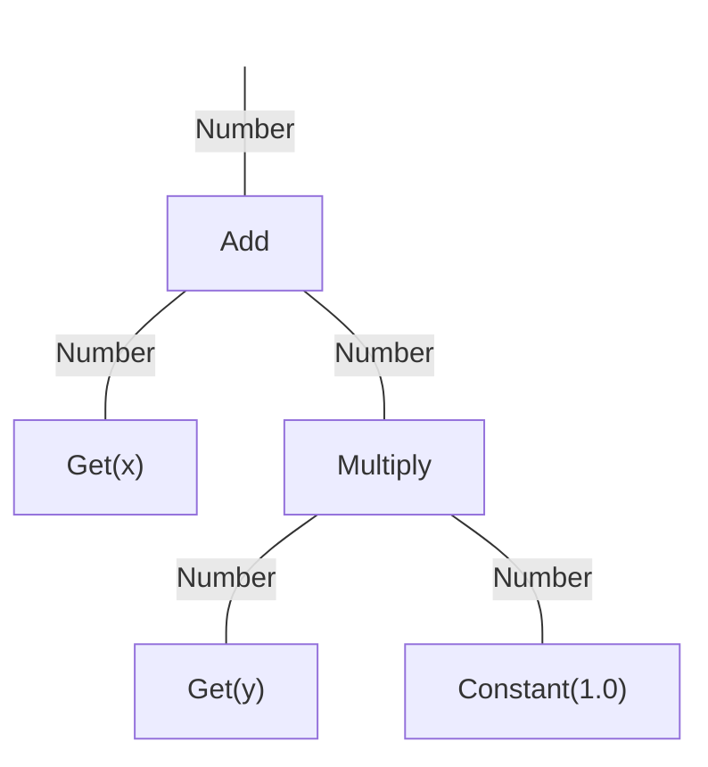

# Decision Variables

A `Solution` consists of one or more decision variables.  All decision variables derive from the `Variable`
interface.  There are a number of built-in decision variable types along with
[mutation and crossover operators](listOfOperators.md) for evolving those types.

To read the value stored in a variable, you must first cast it to the specific type.  For convenience, each
variable defines static methods for reading and writing the values, as demonstrated in the examples below.

## Real

Real-valued decision variables store numbers between some lower and upper bounds.  Internally these are
represented as double precision (64-bit) floating point values.

<!-- :code: src=test/org/moeaframework/snippet/VariableSnippet.java id=real-variable preserveComments -->

```java
// Creating a real-valued variable:
solution.setVariable(i, new RealVariable(lowerBound, upperBound));

// Reading and writing a single variable:
double value = RealVariable.getReal(solution.getVariable(i));
RealVariable.setReal(solution.getVariable(i), value);

// Reading and writing all variables (when all variables in the solution are real-valued):
double[] values = RealVariable.getReal(solution);
RealVariable.setReal(solution, values);
```

## Binary

Binary decision variables represent a bit string of a fixed length.  Each bit has the value `0` or `1` (or
`false` and `true`).  In Java, you can read the value either as a `boolean[]` or using a `BitSet`.

<!-- :code: src=test/org/moeaframework/snippet/VariableSnippet.java id=binary-variable preserveComments -->

```java
// Creating a binary variable:
solution.setVariable(i, new BinaryVariable(length));

// Reading the values as an array or BitSet:
boolean[] bits = BinaryVariable.getBinary(solution.getVariable(i));
BitSet bitSet = BinaryVariable.getBitSet(solution.getVariable(i));

// Updating the bits:
BinaryVariable.setBinary(solution.getVariable(i), bits);
BinaryVariable.setBitSet(solution.getVariable(i), bitSet);
```

## Integer

Integers can be represented using either `RealVariable` or `BinaryIntegerVariable`.  For `RealVariable`, simply
truncate or round the value to produce an integer.  However, we generally recommend using
`BinaryIntegerVariable`, which uses [Gray code](https://en.wikipedia.org/wiki/Gray_code) to ensure a single bit
flip can produce an adjacent integer (`X-1` or `X+1`).

<!-- :code: src=test/org/moeaframework/snippet/VariableSnippet.java id=integer-variable preserveComments -->

```java
// Creating an integer variable:
solution.setVariable(i, new BinaryIntegerVariable(lowerBound, upperBound));

// Reading and writing a single variable:
int value = BinaryIntegerVariable.getInt(solution.getVariable(i));
BinaryIntegerVariable.setInt(solution.getVariable(i), value);

// Reading and writing all variables (when all variables in the solution are integers):
int[] values = BinaryIntegerVariable.getInt(solution);
BinaryIntegerVariable.setInt(solution, values);
```

## Permutation

A permutation is a fixed-length array of $N$ numbers, ranging from $0, ..., N-1$, where the ordering of the
values holds importance.  Furthermore, each value must appear exactly once.  Consequently, permutations are
useful for specifying a sequence of nodes to visit, such as with the Traveling Salesman Problem.

<!-- :code: src=test/org/moeaframework/snippet/VariableSnippet.java id=permutation-variable preserveComments -->

```java
// Creating a permutation:
solution.setVariable(i, new Permutation(length));

// Reading and writing a permutation:
int[] permutation = Permutation.getPermutation(solution.getVariable(i));
Permutation.setPermutation(solution.getVariable(i), permutation);
```

## Subset

Given a set of $N$ numbers, ranging from $0, ..., N-1$, the subset contains some selection of these values.
Two types of subsets can be defined: (1) a fixed-size subset where exactly $K$ values are selected, or (2) a
variable-size subset where the size is defined by some lower bound $L$ and upper bound $U$.  Also note that
the order of values in the subset does not matter.

<!-- :code: src=test/org/moeaframework/snippet/VariableSnippet.java id=subset-variable preserveComments -->

```java
// Creating a fixed and variable-length subset:
solution.setVariable(i, new Subset(fixedSize, numberOfElements));
solution.setVariable(i, new Subset(minSize, maxSize, numberOfElements));

// Reading and writing the sets
int[] subset = Subset.getSubset(solution.getVariable(i));
Subset.setSubset(solution.getVariable(i), subset);
```

## Program

The program type is useful for generating computer code, rule systems, or decision trees.  We begin by
defining the rules used to construct the program.  Each rule defines a "node", which can take the form of a
constant value, an operator, or a function.  Custom nodes can be defined for domain-specific programs.  For
example, here we define rules for constructing simple mathematical expressions:

<!-- :code: src=test/org/moeaframework/snippet/VariableSnippet.java id=program-definition -->

```java
Rules rules = new Rules();
rules.add(new Add());
rules.add(new Multiply());
rules.add(new Subtract());
rules.add(new Divide());
rules.add(new Get(Number.class, "x"));
rules.add(new Get(Number.class, "y"));
rules.add(new Constant(1.0));
rules.setReturnType(Number.class);
rules.setMaxVariationDepth(10);
```

Each node defines the type of its inputs and output.  For example, the `Add` node takes two inputs, both
numbers, and outputs another number.  These types determine how nodes can be composed, with the output from
one node feeding into the input of another, to construct the program tree.  For example, here is one such
program tree resulting from these rules:



Finally, we construct a `Program` decision variable with these rules:

<!-- :code: src=test/org/moeaframework/snippet/VariableSnippet.java id=program-variable -->

```java
solution.setVariable(i, new Program(rules));
```

To evaluate a program, we must supply an `Environment` that defines the values of any referenced variables.
In this example, we defined the variables `"x"` and `"y"`:

<!-- :code: src=test/org/moeaframework/snippet/VariableSnippet.java id=program-evaluate -->

```java
Environment environment = new Environment();
environment.set("x", 5.0);
environment.set("y", 10.0);

Program program = (Program)solution.getVariable(i);
Number result = (Number)program.evaluate(environment);

solution.setObjectiveValue(0, result.doubleValue());
```

## Grammar

The grammar type facilitates grammatical evolution.  This is similar in functionality to programs, except it
used a context-free grammar given in [Backus-Naur form](https://en.wikipedia.org/wiki/Backus%E2%80%93Naur_form).
For example, the following grammar specification:

<!-- :code: src=test/org/moeaframework/snippet/VariableSnippet.java id=grammar-definition language=text -->

```
ContextFreeGrammar cfg = ContextFreeGrammar.load("""
        <expr> ::= '(' <expr> <op> <expr> ')' | <val>
        <val> ::= x | y
        <op> ::= + | - | * | /
        """);
```

would generate statements like `x`, `(x + y)`, `(x + (y / z))`, etc.  However, unlike a program, a grammar can
generate arbitrary statements, not necessarily just executable programs.

The `Grammar` decision variable stores a "codon array", which is simply an array of integers.  This array
determines which rules are applied when constructing the expression.  

<!-- :code: src=test/org/moeaframework/snippet/VariableSnippet.java id=grammar-variable preserveComments -->

```java
// Creating a grammar with a codon length of 10
solution.setVariable(i, new Grammar(10));

// Build an expression from the context-free grammar
Grammar grammar = (Grammar)solution.getVariable(i);
String expression = grammar.build(cfg);

solution.setObjectiveValue(0, evaluate(expression));
```

The expression produced by a grammar is a string.  The process of evaluating this expression to derive the
objective value is up to your specific use case.

