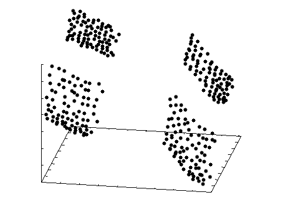
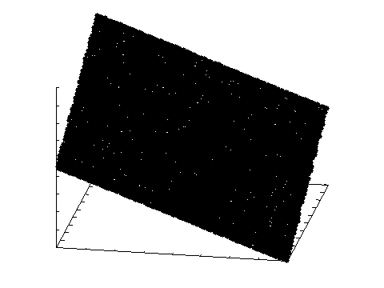
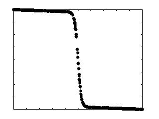
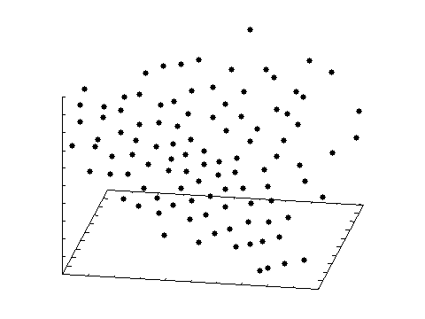

# List of Problems

## Instantiating a Problem

We can create an instance of any problem by calling its constructor:

<!-- java:test/org/moeaframework/snippet/ProblemSnippet.java [36:36] -->

```java
Problem problem = new UF1();
```

Several of these problems can be scaled in terms of the number of decision variables or objectives.  We can call the
relevant constructor to configure the problem.  For example, here we create the three-objective DTLZ2 problem:

<!-- java:test/org/moeaframework/snippet/ProblemSnippet.java [41:41] -->

```java
Problem problem = new DTLZ2(3);
```

## Test Suites

### ZDT

Contains five real-valued and one binary problem [^zitzler00].

Problem | # of Vars | # of Objs | # of Constrs | Type | Constructor | Pareto Front
:------ | :-------: | :-------: | :----------: | :--- | :---------- | ------------
ZDT1 | 30 | 2 | 0 | Real | `new ZDT1()` | 
ZDT2 | 30 | 2 | 0 | Real | `new ZDT2()` | 
ZDT3 | 30 | 2 | 0 | Real | `new ZDT3()` | 
ZDT4 | 10 | 2 | 0 | Real | `new ZDT4()` | 
ZDT5 | 80 | 2 | 0 | Binary | `new ZDT5()` | 
ZDT6 | 10 | 2 | 0 | Real | `new ZDT6()` | 

### DTLZ

Contains unconstrained real-valued problems that are scalable in the number of objectives [^deb01] [^deb02].
These problems are scalable in the number of objectives, controlled by passing the value `N` to the constructor.

Problem | # of Vars | # of Objs | # of Constrs | Type | Constructor | Pareto Front
:------ | :-------: | :-------: | :----------: | :--- | :---------- | ------------
DTLZ1 | `4+N` | `N` | 0 | Real | `new DTLZ1(N)` |  
DTLZ2 | `9+N` | `N` | 0 | Real | `new DTLZ2(N)` |  
DTLZ3 | `9+N` | `N` | 0 | Real | `new DTLZ3(N)` |  
DTLZ4 | `9+N` | `N` | 0 | Real | `new DTLZ4(N)` |  
DTLZ5 | `9+N` | `N` | 0 | Real | `new DTLZ5(N)` |  
DTLZ6 | `9+N` | `N` | 0 | Real | `new DTLZ6(N)` |  
DTLZ7 | `19+N` | `N` | 0 | Real | `new DTLZ7(N)` |  

### LZ

Contains nine real-valued test problems designed to have complicated Pareto sets [^li09].

Problem | # of Vars | # of Objs | # of Constrs | Type | Constructor | Pareto Front
:------ | :-------: | :-------: | :----------: | :--- | :---------- | ------------
LZ1 | 30 | 2 | 0 | Real | `new LZ1()` | 
LZ2 | 30 | 2 | 0 | Real | `new LZ2()` | 
LZ3 | 30 | 2 | 0 | Real | `new LZ3()` | 
LZ4 | 30 | 2 | 0 | Real | `new LZ4()` | 
LZ5 | 30 | 2 | 0 | Real | `new LZ5()` | 
LZ6 | 10 | 3 | 0 | Real | `new LZ6()` | 
LZ7 | 10 | 2 | 0 | Real | `new LZ7()` | 
LZ8 | 10 | 2 | 0 | Real | `new LZ8()` | 
LZ9 | 30 | 2 | 0 | Real | `new LZ9()` | 

### CEC2009

Constrained (CF) and unconstrained (UF) test problems used for the CEC 2009 special session and competition [^zhang09].

Problem | # of Vars | # of Objs | # of Constrs | Type | Constructor | Pareto Front
:------ | :-------: | :-------: | :----------: | :--- | :---------- | ------------
CF1 | 10 | 2 | 1 | Real | `new CF1()` | 
CF2 | 10 | 2 | 1 | Real | `new CF2()` | 
CF3 | 10 | 2 | 1 | Real | `new CF3()` | 
CF4 | 10 | 2 | 1 | Real | `new CF4()` | 
CF5 | 10 | 2 | 1 | Real | `new CF5()` | 
CF6 | 10 | 2 | 2 | Real | `new CF6()` | 
CF7 | 10 | 2 | 2 | Real | `new CF7()` | 
CF8 | 10 | 3 | 1 | Real | `new CF8()` | 
CF9 | 10 | 3 | 1 | Real | `new CF9()` | 
CF10 | 10 | 3 | 1 | Real | `new CF10()` | 
UF1 | 30 | 2 | 0 | Real | `new UF1()` | 
UF2 | 30 | 2 | 0 | Real | `new UF2()` | 
UF3 | 30 | 2 | 0 | Real | `new UF3()` | 
UF4 | 30 | 2 | 0 | Real | `new UF4()` | 
UF5 | 30 | 2 | 0 | Real | `new UF5()` | 
UF6 | 30 | 2 | 0 | Real | `new UF6()` | 
UF7 | 30 | 2 | 0 | Real | `new UF7()` | 
UF8 | 30 | 3 | 0 | Real | `new UF8()` | 
UF9 | 30 | 3 | 0 | Real | `new UF9()` | 
UF10 | 30 | 3 | 0 | Real | `new UF10()` | 
UF11 | 30 | 5 | 0 | Real | `new UF11()` | Not Available
UF12 | 30 | 5 | 0 | Real | `new UF12()` | Not Available
UF13 | 30 | 5 | 0 | Real | `new UF13()` | Not Available

### WFG

Contains nine scalable, real-valued problems by the walking fish group (WFG) [^huband05] [^huband07].

Problem | # of Vars | # of Objs | # of Constrs | Type | Constructor | Pareto Front
:------ | :-------: | :-------: | :----------: | :--- | :---------- | ------------
WFG1 | `9+N` | `N` | 0 | Real | `new WFG1(N)` |  
WFG2 | `9+N` | `N` | 0 | Real | `new WFG2(N)` |  
WFG3 | `9+N` | `N` | 0 | Real | `new WFG3(N)` |  
WFG4 | `9+N` | `N` | 0 | Real | `new WFG4(N)` |  
WFG5 | `9+N` | `N` | 0 | Real | `new WFG5(N)` |  
WFG6 | `9+N` | `N` | 0 | Real | `new WFG6(N)` |  
WFG7 | `9+N` | `N` | 0 | Real | `new WFG7(N)` |  
WFG8 | `9+N` | `N` | 0 | Real | `new WFG8(N)` |  
WFG9 | `9+N` | `N` | 0 | Real | `new WFG9(N)` |  

### CDTLZ

A constrained version of the DTLZ problem suite [^deb14] [^jain14].  These problems are scalable in the number of objectives,
controlled by passing the value `N` to the constructor.

Problem | # of Vars | # of Objs | # of Constrs | Type | Constructor | Pareto Front
:------ | :-------: | :-------: | :----------: | :--- | :---------- | ------------
C1_DTLZ1 | `4+N` | `N` | 1 | Real | `new C1_DTLZ1(N)` |  
C1_DTLZ3 | `9+N` | `N` | 1 | Real | `new C1_DTLZ3(N)` |  
C2_DTLZ2 | `9+N` | `N` | 1 | Real | `new C2_DTLZ2(N)` |  
C3_DTLZ1 | `4+N` | `N` | N | Real | `new C3_DTLZ1(N)` |  
C3_DTLZ4 | `9+N` | `N` | N | Real | `new C3_DTLZ4(N)` |  
Convex_C2_DTLZ2 | `9+N` | `N` | 1 | Real | `new ConvexC2_DTLZ2(N)` |  

### LSMOP

Large-scale multi- and many-objective problem test suite [^cheng17].  These problems are scalable in the number of objectives,
controlled by passing the value `N` to the constructor.

Problem | # of Vars | # of Objs | # of Constrs | Type | Constructor | Pareto Front
:------ | :-------: | :-------: | :----------: | :--- | :---------- | ------------
LSMOP1 | ??? | `N` | 0 | Real | `new LSMOP1(N)` | 
LSMOP2 | ??? | `N` | 0 | Real | `new LSMOP2(N)` | 
LSMOP3 | ??? | `N` | 0 | Real | `new LSMOP3(N)` | 
LSMOP4 | ??? | `N` | 0 | Real | `new LSMOP4(N)` | 
LSMOP5 | ??? | `N` | 0 | Real | `new LSMOP5(N)` | 
LSMOP6 | ??? | `N` | 0 | Real | `new LSMOP6(N)` | 
LSMOP7 | ??? | `N` | 0 | Real | `new LSMOP7(N)` | 
LSMOP8 | ??? | `N` | 0 | Real | `new LSMOP8(N)` | 
LSMOP9 | ??? | `N` | 0 | Real | `new LSMOP9(N)` | 

The number of decision variables depends on the how the problem is configured.  Use
`problem.getNumberOfVariables()` to lookup the exact values.

### ZCAT

Set of challenging test problems for multi- and many-objective optimization [^zapotecas23].  These problems are
scalable in the number of objectives, controlled by passing the value `N` to the constructor.

Problem | # of Vars | # of Objs | # of Constrs | Type | Constructor | Pareto Front
:------ | :-------: | :-------: | :----------: | :--- | :---------- | ------------
ZCAT1 | `10*N` | `N` | 0 | Real | `new ZCAT1(N)` |  
ZCAT2 | `10*N` | `N` | 0 | Real | `new ZCAT2(N)` |  
ZCAT3 | `10*N` | `N` | 0 | Real | `new ZCAT3(N)` |  
ZCAT4 | `10*N` | `N` | 0 | Real | `new ZCAT4(N)` |  
ZCAT5 | `10*N` | `N` | 0 | Real | `new ZCAT5(N)` |  
ZCAT6 | `10*N` | `N` | 0 | Real | `new ZCAT6(N)` |  
ZCAT7 | `10*N` | `N` | 0 | Real | `new ZCAT7(N)` |  
ZCAT8 | `10*N` | `N` | 0 | Real | `new ZCAT8(N)` |  
ZCAT9 | `10*N` | `N` | 0 | Real | `new ZCAT9(N)` |  
ZCAT10 | `10*N` | `N` | 0 | Real | `new ZCAT10(N)` |  
ZCAT11 | `10*N` | `N` | 0 | Real | `new ZCAT11(N)` |  
ZCAT12 | `10*N` | `N` | 0 | Real | `new ZCAT12(N)` |  
ZCAT13 | `10*N` | `N` | 0 | Real | `new ZCAT13(N)` |  
ZCAT14 | `10*N` | `N` | 0 | Real | `new ZCAT14(N)` |  
ZCAT15 | `10*N` | `N` | 0 | Real | `new ZCAT15(N)` |  
ZCAT16 | `10*N` | `N` | 0 | Real | `new ZCAT16(N)` |  
ZCAT17 | `10*N` | `N` | 0 | Real | `new ZCAT17(N)` |  
ZCAT18 | `10*N` | `N` | 0 | Real | `new ZCAT18(N)` |  
ZCAT19 | `10*N` | `N` | 0 | Real | `new ZCAT19(N)` |  
ZCAT20 | `10*N` | `N` | 0 | Real | `new ZCAT20(N)` |  

## Miscellaneous Problems

Individual problems found throughout the literature that do not belong to a specific test suite.

Problem | # of Vars | # of Objs | # of Constrs | Type | Constructor | Pareto Front
:------ | :-------: | :-------: | :----------: | :--- | :---------- | ------------
Belegundu | 2 | 2 | 2 | Real | `new Belegundu()` | 
Binh | 2 | 2 | 0 | Real | `new Binh()` | 
Binh2 | 2 | 2 | 2 | Real | `new Binh2()` | 
Binh3 | 2 | 3 | 0 | Real | `new Binh3()` | 
Binh4 | 2 | 3 | 2 | Real | `new Binh4()` | 
Fonseca | 2 | 2 | 0 | Real | `new Fonseca()` | 
Fonseca2 | 3 | 2 | 0 | Real | `new Fonseca2()` | 
Jimenez (Maximized) | 2 | 2 | 4 | Real | `new Jimenez()` | 
Kita (Maximized) | 2 | 2 | 3 | Real | `new Kita()` | 
Kursawe | 3 | 2 | 0 | Real | `new Kursawe()` | 
Laumanns | 2 | 2 | 0 | Real | `new Laumanns()` | 
Lis | 2 | 2 | 0 | Real | `new Lis()` | 
Murata | 2 | 2 | 0 | Real | `new Murata()` | 
Obayashi (Maximized) | 2 | 2 | 1 | Real | `new Obayashi()` | 
OKA1 | 2 | 2 | 0 | Real | `new OKA1()` | 
OKA2 | 3 | 2 | 0 | Real | `new OKA2()` | 
Osyczka | 2 | 2 | 2 | Real | `new Osyczka()` | 
Osyczka2 | 6 | 2 | 6 | Real | `new Osyczka2()` | 
Poloni (Maximized) | 2 | 2 | 0 | Real | `new Poloni()` | 
Quagliarella | 16 | 2 | 0 | Real | `new Quagliarella()` | 
Rendon | 2 | 2 | 0 | Real | `new Rendon()` | 
Rendon2 | 2 | 2 | 0 | Real | `new Rendon2()` | 
Schaffer | 1 | 2 | 0 | Real | `new Schaffer()` | 
Schaffer2 | 1 | 2 | 0 | Real | `new Schaffer2()` | 
Srinivas | 2 | 2 | 2 | Real | `new Srinivas()` | 
Tamaki (Maximized) | 3 | 3 | 1 | Real | `new Tamaki()` | 
Tanaka | 2 | 2 | 2 | Real | `new Tanaka()` | 
Viennet | 2 | 3 | 0 | Real | `new Viennet()` | 
Viennet2 | 2 | 3 | 0 | Real | `new Viennet2()` | 
Viennet3 | 2 | 3 | 0 | Real | `new Viennet3()` | 
Viennet4 | 2 | 3 | 3 | Real | `new Viennet4()` | 

Note that several of these problems are maximized.  Since the MOEA Framework only supports minimization, the
objective values are negated!

## BBOB-2016

Contains the 55 bi-objective problems from the "bbob-biobj" test suite presented at the GECCO 2016 BBOB
workshop [^finck15].  These bi-objective problems are formed by combining two single-objective functions.  The easiest
way to construct a BBOB 2016 problem instance is from its name.  Each single-objective function is defined
by its (1) test function number, (2) instance number, and (3) dimension, given as:

```
bbob_f<val>_i<val>_d<val>
```

For example, `bbob_f1_i2_d5` would use function `1` (Sphere), instance `2`, and `5` decision variables.  Then,
to construct the two-objective version, we simply combine two of these single-objective functions with a comma.
Here's an example:

<!-- java:test/org/moeaframework/snippet/ProblemSnippet.java [52:52] -->

```java
Problem problem = ProblemFactory.getInstance().getProblem("bbob-biobj(bbob_f1_i2_d5,bbob_f21_i2_d5)");
```

For more details on the specific problem instances, see http://numbbo.github.io/coco-doc/bbob-biobj/functions/.

## Problem Wrappers

Problem wrappers modify or extend existing problems, typically in an effort to make the problem more challenging.

### Scaling Objectives

The `ScaledProblem` wrapper applies a scaling factor to each objective by multipling the i-th objecive
value by $b^i$, where $b=2$ in the example below.  This helps avoid any bias caused by assuming all objectives
have similar ranges.

<!-- java:test/org/moeaframework/snippet/ProblemSnippet.java [58:58] -->

```java
Problem problem = new ScaledProblem(new DTLZ2(2), 2.0);
```

### Rotating Decision Variables

The `RotatedProblem` wrapper applies a rotation to the decision variables.  This is beneficial as it converts what
would be independent decision variables (which is typically easier to optimize) into a version with linear relationships
between the variables.  We can customize the rotation matrix, selecting all or a subset of decision variables, by
constructing the `RotationMatrixBuilder`.  The example below demonstrates applying a 45 degree rotation to each axis.

<!-- java:test/org/moeaframework/snippet/ProblemSnippet.java [63:66] -->

```java
RotationMatrixBuilder builder = new RotationMatrixBuilder(11);
builder.rotateAll().withThetas(Math.toRadians(45));

Problem problem = new RotatedProblem(new DTLZ2(2), builder.create());
```

### Timings

The `TimingProblem` wrapper is used to measure the total time spent performing function evaluations.  This can
capture up to a nanoseconds resolution, as long as the system supports that level of accuracy.

<!-- java:test/org/moeaframework/snippet/ProblemSnippet.java [71:73] -->

```java
TimingProblem problem = new TimingProblem(new DTLZ2(2));

System.out.println(problem.getNFE() + " evaluations took " + problem.getSeconds() + " sec.");
```

[^cheng17]: Cheng et al. "Test problems for large-scale multiobjective and many-objective optimization." IEEE Transactions on Cybernetics, 7(12): 4108-4121, 2017.
[^deb01]: Deb et al.  "Scalable Test Problems for Evolutionary Multi-Objective Optimization."  TIK-Technical Report No 112, 2001.
[^deb02]: Deb et al. "Scalable Multi-Objective Optimization Test Problems." Congress on Evolutionary Computation. pp 825-830, 2002.
[^deb14]: Deb, K. and H. Jain.  "An Evolutionary Many-Objective Optimization Algorithm Using Reference-Point-Based Nondominated Sorting Approach, Part I: Solving Problems With Box Constraints."  IEEE Transactions on Evolutionary Computation, 18(4):577-601, 2014.
[^jain14]: Jain, H. and K. Deb.  "An Evolutionary Many-Objective Optimization Algorithm Using Reference-Point-Based Nondominated Sorting Approach, Part II: Handling Constraints and Extending to an Adaptive Approach." IEEE Transactions on Evolutionary Computation, 18(4):602-622, 2014.
[^finck15]: Finck, S., N. Hansen, R. Ros, and A. Auger.  "Real-Parameter Black-Box Optimization Benchmarking 2010: Presentation of the Noiseless Functions."  Working Paper 2009/20, compiled November 17, 2015.
[^huband07]: Huband et al. "A Review of Multi-Objective Test Problems and a Scalable Test Problem Toolkit." IEEE Transactions on Evolutionary Computation. 10(5):477-506, 2007.
[^huband05]: Huband et al. "A Scalable Multi-Objective Test Problem Toolkit." 3rd International Conference on Evolutionary Multi-Criterion Optimization. pp 280-294, 2005.
[^li09]: Li and Zhang (2009). "Multiobjective Optimization Problems with Complicated Pareto Sets, MOEA/D and NSGA-II."  IEEE Transactions on Evolutionary Computation.  13(2):284-302.
[^zapotecas23]: Zapotecas-Martínez et al.  "Challenging test problems for multi-and many-objective optimization." Swarm and Evolutionary Computation, Volume 81, 101350, ISSN 2210-6502, 2023.
[^zhang09]: Zhang et al (2009).  "Multiobjective Optimization Test Instances for the CEC 2009 Special Session and Competition."  Technical Report CES-487, The School of Computer Science and Electronic Engineering, University of Essex.
[^zitzler00]: Zitzler et al.  "Comparison of Multiobjective Evolutionary Algorithms: Empirical Results."  Evolutionary Computation Journal.  8(2):125-148, 2000.
