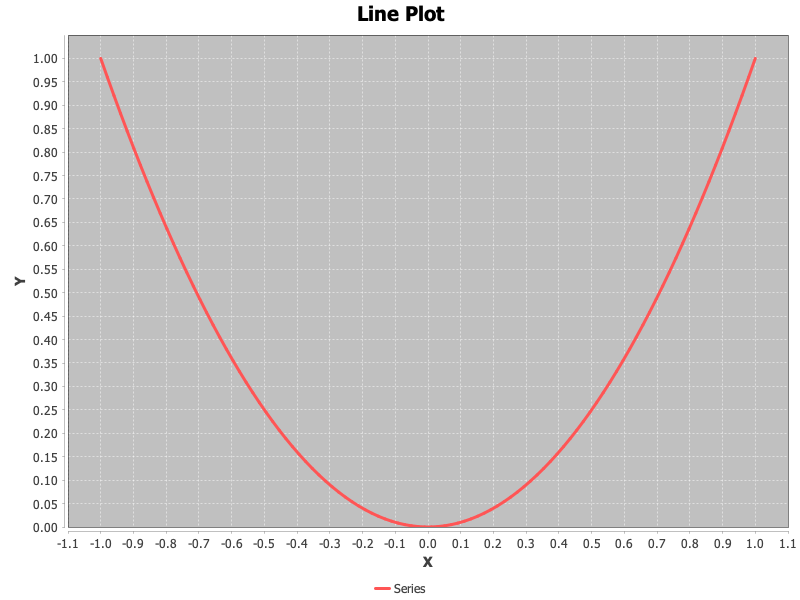

# Plotting Data

While not intended to offer comprehensive plotting capabilities, we do provide classes for generating basic 2D plots.
All plotting code utilizes a builder pattern, whereby the plot is constructed by making one or more calls to configure
the plot.  Below we demonstrate creating and styling the various plot types.


## XY Plots

XY plots display one or more series of data along the X and Y axes.  The specific method that is called controls how
the data is rendered.

### Line Plot

<!-- :code: src=test/org/moeaframework/analysis/plot/XYPlotBuilderTest.java id=linePlot -->

```java
double[] x = IntStream.range(0, 100).mapToDouble(i -> i - 50).toArray();
double[] y = DoubleStream.of(x).map(d -> Math.pow(d, 2)).toArray();

new XYPlotBuilder()
        .line("Series", x, y)
        .title("Line Plot")
        .xLabel("X")
        .yLabel("Y")
        .show();
```

<p align="center">
	
</p>

### Scatter Plot

<!-- :code: src=test/org/moeaframework/analysis/plot/XYPlotBuilderTest.java id=scatterPlot -->

```java
new XYPlotBuilder()
        .scatter("Series", x, y)
        .title("Scatter Plot")
        .xLabel("X")
        .yLabel("Y")
        .show();
```

<p align="center">
	
</p>

### Area Plot

<!-- :code: src=test/org/moeaframework/analysis/plot/XYPlotBuilderTest.java id=areaPlot -->

```java
new XYPlotBuilder()
        .area("Series", x, y)
        .title("Area Plot")
        .xLabel("X")
        .yLabel("Y")
        .show();
```

<p align="center">
	
</p>

### Deviation

<!-- :code: src=test/org/moeaframework/analysis/plot/XYPlotBuilderTest.java id=deviationPlot -->

```java
new XYPlotBuilder()
        .deviation("Series", x, y)
        .title("Deviation Plot")
        .xLabel("X")
        .yLabel("Y")
        .show();
```

<p align="center">
	
</p>

### Histogram

Unlike the previous plots, a histogram is generated from a single array of values.  The Y axis measures the number of
times each value appears in the input.

<!-- :code: src=test/org/moeaframework/analysis/plot/XYPlotBuilderTest.java id=histogram -->

```java
double[] values = IntStream.range(0, 10000).mapToDouble(i -> PRNG.nextGaussian()).toArray();

new XYPlotBuilder()
        .histogram("Values", values)
        .title("Histogram")
        .xLabel("Value")
        .yLabel("Count")
        .show();
```

<p align="center">
	
</p>

