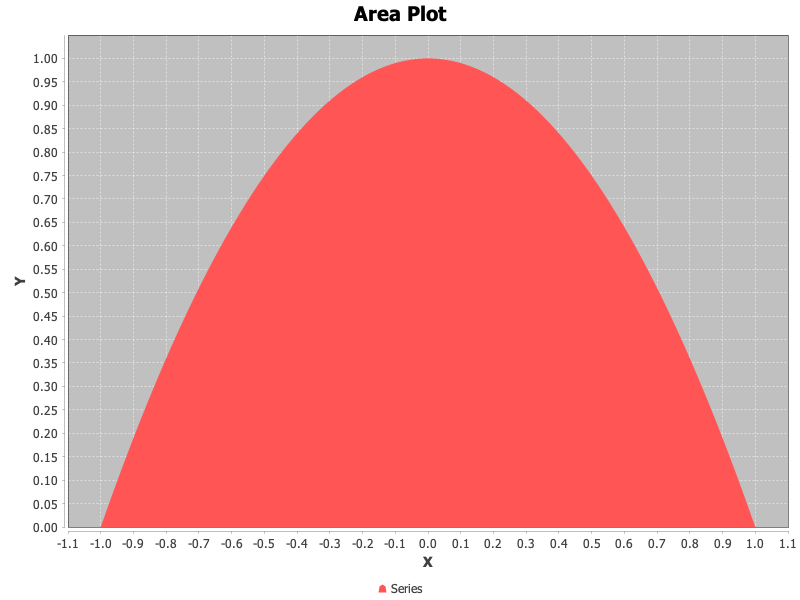
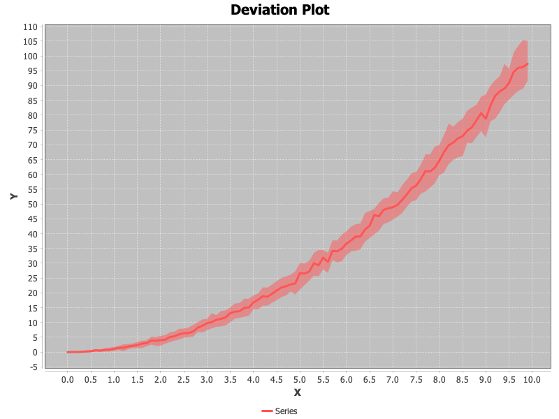

# Plotting Data

While not intended to offer comprehensive plotting capabilities, we do provide classes for generating basic 2D plots.
All plotting code utilizes a builder pattern, whereby the plot is constructed by making one or more calls to configure
the plot.  Below we demonstrate creating and styling the various plot types.


## XY Plots

XY plots display one or more series of data along the X and Y axes.  The specific method that is called controls how
the data is rendered.

### Line Plot

Here we plot a line graph of $$f(x) = x^2$$ for $$x \in [-1, 1]$$.  We can provide arrays directly to the plotting
methods:

<!-- :code: src=examples/org/moeaframework/examples/misc/PlottingExample.java id=linePlotXYData -->

```java
int N = 100;
double[] x = new double[N];
double[] y = new double[N];

for (int i = 0; i < N; i++) {
    x[i] = -1.0 + 2.0 * i / (N - 1);
    y[i] = Math.pow(x[i], 2.0);
}

new XYPlotBuilder()
        .line("Series", x, y)
        .title("Line Plot")
        .xLabel("X")
        .yLabel("Y")
        .show();
```

<!-- :plot: src=examples/org/moeaframework/examples/misc/PlottingExample.java method=linePlotXYData dest=imgs/plot-line.png width=70% -->

<p align="center">
	
</p>

Plots can also be generated directly from our stream classes.  The data, stored as a `Partition` (which is just a
collection of key-value pairs, is identical to the previous example, but expressed in a more compact and readable style.

<!-- :code: src=examples/org/moeaframework/examples/misc/PlottingExample.java id=linePlotPartition -->

```java
Partition<Double, Double> data = DataStream.range(-1.0, 1.0, 100).map(d -> Math.pow(d, 2));

new XYPlotBuilder()
        .line("Series", data)
        .title("Line Plot")
        .xLabel("X")
        .yLabel("Y")
        .show();
```

### Scatter Plot

<!-- :code: src=examples/org/moeaframework/examples/misc/PlottingExample.java id=scatterPlot -->

```java
new XYPlotBuilder()
        .scatter("Series", x, y)
        .title("Scatter Plot")
        .xLabel("X")
        .yLabel("Y")
        .show();
```

<!-- :plot: src=examples/org/moeaframework/examples/misc/PlottingExample.java method=scatterPlot dest=imgs/plot-scatter.png width=70% -->

<p align="center">
	
</p>

### Combined Plots / Multiple Series

<!-- :code: src=examples/org/moeaframework/examples/misc/PlottingExample.java id=combinedPlot -->

```java
new XYPlotBuilder()
        .line("Series1", x, y1, Style.blue(), Style.large())
        .scatter("Series2", x, y2, Style.red(), Style.circle())
        .title("Combined Plot")
        .xLabel("X")
        .yLabel("Y")
        .show();
```

<!-- :plot: src=examples/org/moeaframework/examples/misc/PlottingExample.java method=combinedPlot dest=imgs/plot-combined.png width=70% -->

<p align="center">
	
</p>

### Area Plot

<!-- :code: src=examples/org/moeaframework/examples/misc/PlottingExample.java id=areaPlot -->

```java
new XYPlotBuilder()
        .area("Series", x, y)
        .title("Area Plot")
        .xLabel("X")
        .yLabel("Y")
        .show();
```

<!-- :plot: src=examples/org/moeaframework/examples/misc/PlottingExample.java method=areaPlot dest=imgs/plot-area.png width=70% -->

<p align="center">
	
</p>

### Stacked Area Plot

<!-- :code: src=examples/org/moeaframework/examples/misc/PlottingExample.java id=stackedAreaPlot -->

```java
new XYPlotBuilder()
        .stacked("Series1", x, y1)
        .stacked("Series2", x, y2)
        .title("Stacked Area Plot")
        .xLabel("X")
        .yLabel("Y")
        .show();
```

<!-- :plot: src=examples/org/moeaframework/examples/misc/PlottingExample.java method=stackedAreaPlot dest=imgs/plot-stackedArea.png width=70% -->

<p align="center">
	
</p>

### Deviation

<!-- :code: src=examples/org/moeaframework/examples/misc/PlottingExample.java id=deviationPlot -->

```java
new XYPlotBuilder()
        .deviation("Series", x, y)
        .title("Deviation Plot")
        .xLabel("X")
        .yLabel("Y")
        .show();
```

<!-- :plot: src=examples/org/moeaframework/examples/misc/PlottingExample.java method=deviationPlot dest=imgs/plot-deviation.png width=70% -->

<p align="center">
	
</p>

### Histogram

Unlike the previous plots, a histogram is generated from a single array of values.  The Y axis measures the number of
times each value appears in the input.

<!-- :code: src=examples/org/moeaframework/examples/misc/PlottingExample.java id=histogram -->

```java
double[] values = IntStream.range(0, 10000).mapToDouble(i -> PRNG.nextGaussian()).toArray();

new XYPlotBuilder()
        .histogram("Values", values)
        .title("Histogram")
        .xLabel("Value")
        .yLabel("Count")
        .show();
```

<!-- :plot: src=examples/org/moeaframework/examples/misc/PlottingExample.java method=histogram dest=imgs/plot-histogram.png width=70% -->

<p align="center">
	
</p>

### Heat Map

Unlike the previous plots, a histogram is generated from a single array of values.  The Y axis measures the number of
times each value appears in the input.

<!-- :code: src=examples/org/moeaframework/examples/misc/PlottingExample.java id=heatMap -->

```java
double[] x = IntStream.range(0, 100).mapToDouble(i -> i / 100.0).toArray();
double[] y = IntStream.range(0, 200).mapToDouble(i -> i / 100.0).toArray();
double[][] z = new double[x.length][y.length];

for (int i = 0; i < x.length; i++) {
    for (int j = 0; j < y.length; j++) {
        z[i][j] = i * Math.sqrt(j);
    }
}

new HeatMapBuilder()
        .xCoords(x)
        .yCoords(y)
        .zData(z)
        .style(Style.showToolTips(), Style.red())
        .xLabel("X")
        .yLabel("Y")
        .zLabel("Value")
        .show();
```

<!-- :plot: src=examples/org/moeaframework/examples/misc/PlottingExample.java method=heatMap dest=imgs/plot-heatMap.png width=70% -->

<p align="center">
	
</p>
