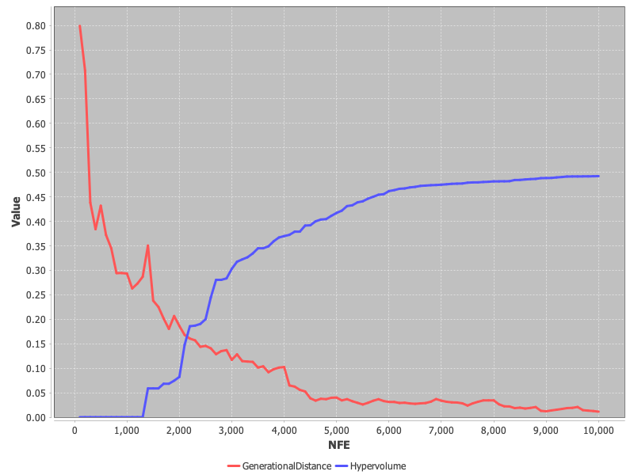
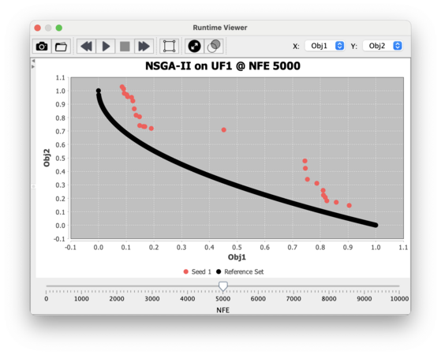
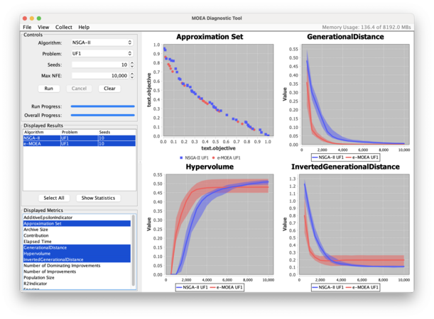

# Collecting Runtime Data

In the examples thus far, we demonstrated running an algorithm for a given number of function evaluations (NFE) and
processing the end-of-run result.  Here we introduce the `Instrumenter` class as a means to collect runtime data from
algorithms.

## Convergence of Performance Indicators

As demonstrated below, we configure the `Instrumenter` with the reference set, collection frequency (every 100 NFE),
and specify what to collect.  Here, we collect the hypervolume and generational distance metrics:

<!-- :code: src=examples/org/moeaframework/examples/runtime/PrintRuntimeDynamics.java lines=35:50 -->

```java
Problem problem = new UF1();
NSGAII algorithm = new NSGAII(problem);

Instrumenter instrumenter = new Instrumenter()
        .withReferenceSet("pf/UF1.pf")
        .withFrequency(Frequency.ofEvaluations(100))
        .attachHypervolumeCollector()
        .attachGenerationalDistanceCollector();

InstrumentedAlgorithm<NSGAII> instrumentedAlgorithm = instrumenter.instrument(algorithm);
instrumentedAlgorithm.run(10000);

instrumentedAlgorithm.getSeries().display();
```

Observe how we use the `Instrumenter` to instrument the algorithm, receiving back an `InstrumentedAlgorithm`.  This class
handles collecting the data as the algorithm runs, returning the data as `ResultSeries`.  Calling `display()` prints
a table with the data:

<!-- :exec: src=examples/org/moeaframework/examples/runtime/PrintRuntimeDynamics.java lines=:12 showEllipsis -->

```
NFE   GenerationalDistance Hypervolume
----- -------------------- --------------------
100   0.7990302827396484   0.0
200   0.7077528123350488   0.0
300   0.43811344531671487  0.0
400   0.38387314467599964  0.0
500   0.43179862562213783  0.0
600   0.3721480391572563   0.0
700   0.3448605207000155   0.0
800   0.2942521614055578   0.0
900   0.29438617862560557  0.0
1000  0.2933094213947678   0.0
...
```

Alternatively, we can pass the series to the `XYPlotBuilder` class to produce a line graph of the runtime data:

<!-- :code: src=examples/org/moeaframework/examples/runtime/PlotRuntimeDynamics.java lines=51:54 -->

```java
new XYPlotBuilder()
    .lines(instrumentedAlgorithm.getSeries())
    .show();
```

<!-- :plot: src=examples/org/moeaframework/examples/runtime/PlotRuntimeDynamics.java dest=imgs/runtime-linegraph.png width=60% -->

<p align="center">
	
</p>

## Visualizing Approximation Set Convergence

We can also collect the approximation set throughout a run, using the built-in `RuntimeViewer` to display an interactive
plot showing the convergence of the approximation set.

<!-- :code: src=examples/org/moeaframework/examples/runtime/RuntimeViewerExample.java lines=36:51 -->

```java
Problem problem = new UF1();
NSGAII algorithm = new NSGAII(problem);

Instrumenter instrumenter = new Instrumenter()
        .withReferenceSet("pf/UF1.pf")
        .withFrequency(Frequency.ofEvaluations(100));

InstrumentedAlgorithm<NSGAII> instrumentedAlgorithm = instrumenter.instrument(algorithm);
instrumentedAlgorithm.run(10000);

RuntimeViewer.show("NSGAII on UF1",
        instrumenter.getReferenceSet(),
        instrumentedAlgorithm.getSeries());
```

<p align="center">
	
</p>

## Diagnostic Tool

The Diagnostic Tool is a GUI that provides a convenient way to run and visualize the algorithms.  To start the
Diagnostic Tool, run:

```bash
./cli LaunchDiagnosticTool
```

Below is an example comparing NSGA-II and $\epsilon$-MOEA on the UF1 test problem.  Note how the controls on the
left-hand side allow us to select and view different problems, algorithms, and quality indicators.

<p align="center">
	
</p>
