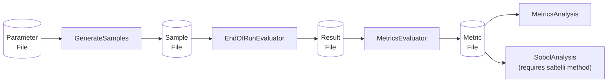

# Sensitivity Analysis

The MOEA Framework was originally built to perform sensitivity analysis on MOEAs, as detailed in this study:

> Hadka, D. and Reed, P.  "Diagnostic Assessment of Search Controls and Failure Modes in Many-Objective
> Evolutionary Optimization."  Evolutionary Computation, 20(3):423-452, 2012.

This document demonstrates the basics of performing a sensitivity analysis study on a single algorithm and problem.
The steps we will perform are depicted below:



The full script used in this example can be found at [sensitivity.sh](../examples/org/moeaframework/examples/experiment/sensitivity.sh).
For more information about any of the commands being run, see the [Command Line Tools reference](commandLineTools.md).

## Parameter File

We start with a parameter file that defines the parameters being investigated along with the minimum and maximum bounds
for sampling.  Note the parameter names must match the configurable properties for the algorithm being studied.

<!-- text:examples/org/moeaframework/examples/experiment/NSGAII_Params.txt -->

```text
maxEvaluations        int     1000 10000
populationSize        int     10   500
sbx.rate              decimal 0.0  1.0
sbx.distributionIndex decimal 1.0  50.0
pm.rate               decimal 0.0  1.0
pm.distributionIndex  decimal 1.0  50.0
```

## Generate Samples

Using the parameter file we defined above, we next generate the parameter samples.  Each line in the samples
file contains the parameters for a single execution.  Also note that the choice of sample generation method can affect
the type of analyses that can be performed.  For example, to compute the first, second, and total-order effects of the
parameters using Sobol sensitivity analysis, use the `saltelli` method. 

<!-- bash:examples/org/moeaframework/examples/experiment/sensitivity.sh [15:19] -->

```bash
java -classpath "lib/*:dist/*" org.moeaframework.analysis.tools.SampleGenerator \
    --parameterFile examples/org/moeaframework/examples/experiment/NSGAII_Params.txt \
    --method saltelli \
    --numberOfSamples 500 \
    --output NSGAII_Samples.txt
```

## Evaluating Samples

Next, we evaluate the algorithm against each of the parameter samples.  This produces a Result File that contains
the Pareto approximation sets produced by each parameterization.

<!-- bash:examples/org/moeaframework/examples/experiment/sensitivity.sh [22:28] -->

```bash
java -classpath "lib/*:dist/*" org.moeaframework.analysis.tools.EndOfRunEvaluator \
    --parameterFile examples/org/moeaframework/examples/experiment/NSGAII_Params.txt \
    --input NSGAII_Samples.txt \
    --output NSGAII_DTLZ2_Results.txt \
    --problem DTLZ2 \
    --algorithm NSGAII \
    --epsilon 0.01
```

## Computing Metrics

We typically evaluate the performance of an algorithm using one of the performance indicators (e.g., hypervolume).
Here, we take the result file produced in the previous step and compute the metrics.

<!-- bash:examples/org/moeaframework/examples/experiment/sensitivity.sh [30:34] -->

```bash
java -classpath "lib/*:dist/*" org.moeaframework.analysis.tools.MetricsEvaluator \
    --input NSGAII_DTLZ2_Results.txt \
    --output NSGAII_DTLZ2_Metrics.txt \
    --problem DTLZ2 \
    --epsilon 0.01
```

## Controllability Analysis

In our original sensitivity analysis study, we compared algorithms based on their attainment, efficiency, and
controllability.  These values are computed using the `MetricsAnalysis` tool.

<!-- bash:examples/org/moeaframework/examples/experiment/sensitivity.sh [36:43] -->

```bash
java -classpath "lib/*:dist/*" org.moeaframework.analysis.tools.MetricsAnalysis \
    --controllability \
    --efficiency \
    --band 100 \
    --parameterFile examples/org/moeaframework/examples/experiment/NSGAII_Params.txt \
    --parameters NSGAII_Samples.txt \
    --metric InvertedGenerationalDistance \
    NSGAII_DTLZ2_Metrics.txt
```

## Parameter Sensitivities

If using the `saltelli` sampling method, we can also compute the first-, second-, and total-order effects of the
parameters.  This measures how much influence each parameter, or pair, contributes to the performance of the
algorithm.

<!-- bash:examples/org/moeaframework/examples/experiment/sensitivity.sh [45:48] -->

```bash
java -classpath "lib/*:dist/*" org.moeaframework.analysis.tools.SobolAnalysis \
    --parameterFile examples/org/moeaframework/examples/experiment/NSGAII_Params.txt \
    --input NSGAII_DTLZ2_Metrics.txt \
    --metric Hypervolume
```
