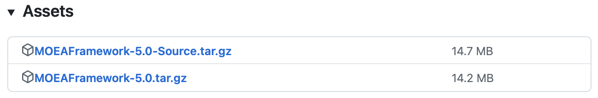
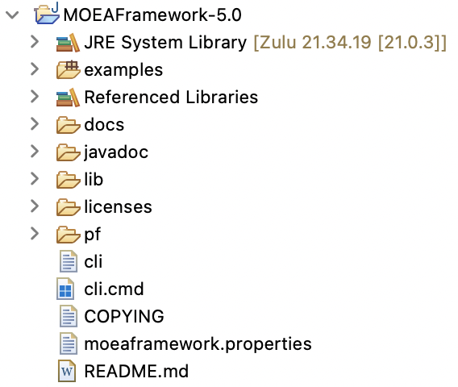
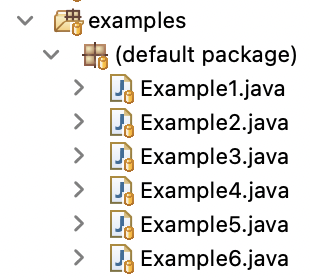

# Setup

## Prerequisites

Download and install the latest version of Java Development Kit (JDK).  Version 17 or later is required.  For Windows,
we recommend either [Eclipse Temurin](https://adoptium.net/) or [Azul Zulu](https://www.azul.com/downloads/?package=jdk).
Linux users with Apt can run `sudo apt install default-jdk`.

While not required, we recommend using [Eclipse](http://eclipse.org) as your Java editor.  The instructions found in
these docs are tailored for Eclipse.

## Setting up an Eclipse Project

Download the source or compiled binaries from the [Releases page](https://github.com/MOEAFramework/MOEAFramework/releases).
We generally recommend the compiled binaries, `MOEAFramework-5.0.tar.gz`, unless you are planning to make changes to
the MOEA Framework itself.



After extracting the download, select `File > Open Projects from File System` within Eclipse and open the extracted
directory.  Once imported, you should see the following in the package explorer:



### Running Examples

The examples are contained in the `examples/` directory.  Navigate to the `examples > (default package)`
to view the introductory examples:



Right-click on an example and select `Run As > Java Application`.  You should soon see output appearing in the
console.

### Command Line

Alternatively, we can also run examples directly from the command line:

```bash
java -classpath "lib/*" examples/Example1.java
```

### Next Steps

Congratulations, you're all set up!  As you get started using the MOEA Framework, check out the `examples/` and `docs/`
to learn more.  If you need to find out information about any specific class, see the published API specification
under `javadoc/`.

