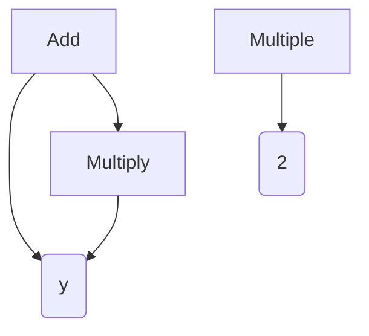

# Decision Variable Types

## Real

Real-valued decision variables store numbers between $\pm \inf$ but are typically restricted to some finite lower and upper bounds.  Internally these are
represented as double precision (64-bit) floating point values.

```java

solution.setVariable(i, EncodingUtils.newReal(lowerBound, upperBound));

double value = EncodingUtils.getReal(solution.getVariable(i));
```

## Binary

Binary decision variables represent a bit string of a fixed length.  Each bit has the value `0` or `1` (or `false` and `true`).  

```java

solution.setVariable(i, EncodingUtils.newBinary(length));

boolean[] bits = EncodingUtils.getBinary(solution.getVariable(i));
BitSet bits = EncodingUtils.getBitSet(solution.getVariable(i));
```

## Integer

Integers can be represented internally using either the real or binary encoding.  The choice of encoding affects what operators are available.  We generally
recommend using binary.  By default, the binary representation uses [Gray code](https://en.wikipedia.org/wiki/Gray_code) to ensure a single bit
flip can produce an adjacent integer ($N-1$ or $N+1$).

```java

solution.setVariable(i, EncodingUtils.newInt(lowerBound, upperBound));
solution.setVariable(i, EncodingUtils.newBinaryInt(lowerBound, upperBound));

int value = EncodingUtils.getInt(solution.getVariable(i));
```

## Permutation

A permutation is a fixed-length array of numbers from $0, ..., N-1$ where $N$ is the length of the permutation with some ordering.  For example, permutations are
used in Traveling Salesman Problem to specify the order that cities are visited.

```java

solution.setVariable(i, EncodingUtils.newPermutation(length));

int[] permutation = EncodingUtils.getPermutation(solution.getVariable(i));
```

## Subset

A subset is a fixed or variable-length array of numbers from the set $0, ..., N-1$.  Unlikes a permutation that contains all elements, subsets only contain some
of the elements.  For example, subsets are often used in Bin Packing / Knapsack problems where we pick some assortment of items to fill the bag.

```java

solution.setVariable(i, EncodingUtils.newSubset(fixedSize, numberOfElements));
solution.setVariable(i, EncodingUtils.newSubset(minSize, maxSize, numberOfElements));

int[] subset = EncodingUtils.getSubset(solution.getVariable(i));
```

## Program

Program decision variables are useful when generating computer code, rule systems, or decision trees.  The MOEA Framework has a strongly-typed programming
language built into it that can generate executable programs.

It works by constructing a program tree, where each leaf in the tree is a "node".  A node represents some operation, like a function, that takes some
inputs and produce an output.  The inputs and output are typed.  This way, when we evolve the program, we can ensure the types of inputs and outputs
are compatible.



where each node is like a function with some number of inputs and a single output.  Furthermore, the inputs and
outputs are typed.  This way, when we attempt to connect the output from one node to the input of another, we can validate the types are compatible.
For example, the `Add` node takes two numbers as input and produces a single output - their sum.

As an example, let's consider constructing a simple mathematical program.  The first step is to define a rule set, which defines the supported nodes along
with the program's return type.  Also note we can create inputs, in this case the variable `x`.

```java

		Rules rules = new Rules();
		rules.add(new Add());
		rules.add(new Multiply());
		rules.add(new Subtract());
		rules.add(new Divide());
		rules.add(new Sin());
		rules.add(new Cos());
		rules.add(new Exp());
		rules.add(new Log());
		rules.add(new Get(Number.class, "x"));
		rules.setReturnType(Number.class);
```

Our problem creates new solutions as follows:

```java
public class SimpleCalculatorProblem implements Problem

    public Solution newSolution() {
        Solution solution = new Solution(1, 1);
        solution.setVariable(0, new Program(rules));
        return solution;
    }

    public void evaluate(Solution solution) {
        Program program = (Program)solution.getVariable(0);

        Environment environment = new Environment();
        environment.set("x", 15);
    
        double result = (Number)program.evaluate(environment)).doubleValue();
    
        solution.setObjective
    }
}
```


## Grammar

Grammatical evolution 

## Mixing Types

The MOEA Framework is able to automatically recognize and select appropriate variation operators when a solution contains a single type.  However, it is
unable to do so when mixing differen types in the same solution.  Instead, we need to explicitly set the variation operators.


