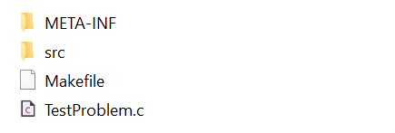

# Natively-Compiled Functions

This example demonstrates how to construct native problems, where we write the function in a language like C, C++,
or Fortran, using our tool for generating problem templates.  This process involves four steps:

1. Using the `BuildProblem` tool to generate the template for a given programming language (e.g., C)
2. Updating the generated template files to define our problem
3. Compiling and testing the problem
4. Linking the compiled code back with the MOEA Framework

While there is a small amount of additional overhead, writing complex functions in a native language will typically
outperform their Java equivalent.

## Prerequisites

To run this example, you will need a C/C++ compiler and Make.  For Windows, we recommend using
[MSYS2](https://www.msys2.org/) with MinGW.  After installing MSYS2, open the MinGW64 terminal and run:

```bash
pacman -S make mingw-w64-x86_64-gcc
```

## Supported Languages

The following table lists the programming languages supported by the `BuildProblem` tool.  Specify the language
using the `--language` option when running this tool.

Language | Default Compiler | Notes
-------- | ---------------- | -----
C        | `gcc`            | C function
CPP      | `g++`            | C++ function.  Output includes `.c` and `.h` file
Fortran  | `gfortran`       | Fortran90 function
Java     | `javac`          | Java problem definition (see [Writing Problems in Java](writingJavaProblems.md))
Python   |                  | Python program using Standard I/O
External |                  | External C/C++ problem using Standard I/O
Matlab   |                  | Uses `MatlabEngine` to call Matlab function (**experimental**)

## Example

For this example, we will implement the Schaffer problem, given as $f(x) = (x^2, (x-2)^2)$, in the C programming
language.  This problem has a single decision variable, $-10 \leq x \leq 10$, and two objectives.

### Step 1 - Generating the Problem Template

The `BuildProblem` tool generates templates for writing problems in other programming languages.  This includes
both the file for defining the function in the chosen language, several Java classes used to interface with the 
MOEA Framework, and a Makefile for compiling and testing the code.

We run this tool as follows:

```bash
java -classpath "lib/*" org.moeaframework.builder.BuildProblem --problemName TestProblem --language c \
	--numberOfVariables 1 --numberOfObjectives 2 --lowerBound -10.0 --upperBound 10.0
```

By default, the generated files are created under the `native/` folder, such as `native/TestProblem` in this
example.  The exact contents will vary for the different programming languages, but should appear similar to:



The `src/` and `META-INF/` folders contain the Java-specific files for integrating the native code with the
MOEA Framework.  In most scenarios, these files can be left unchanged.

### Step 2 - Writing the Function

For this example, which is being written in C, the function will be defined in `TestProblem.c`.  Other languages
will have a similar file, with a different extension, for defining the function.  To begin, open `TestProblem.c`
in an editor of your choice.  The contents will look similar to:

```c
int nvars = 1;
int nobjs = 2;
int nconstrs = 0;

void evaluate(double* vars, double* objs, double* constrs) {
	// TODO: Fill in with your function definition
}
```

Note that the generated template defines a function taking three arguments: the decision variables `vars`, the
computed objective values `objs`, and the computed constraint values `constrs`.  `objs` and `constrs` are outputs.
We can fill in the body of the function as follows to implement the Schaffer problem:

```c
void evaluate(double* vars, double* objs, double* constrs) {
	double x = vars[0];
	
	objs[0] = x * x;
	objs[1] = (x - 2.0) * (x - 2.0);
}
```

Since this function has a single decision variable, we are fine to use the lower and upper bounds we provided when
generating the template files.  However, if you need to supply different bounds, edit `TestProblem.java` and make
the required changes.

### Step 3 - Compiling and Testing

After saving these changes, we can use the provided `Makefile` to compile the code by running:

```bash
make
```

This `Makefile` compiles the code into the `bin/` directory, where you will find the shared library such as
`TestProblem.dll` on Windows or `libTestProblem.so` on Linux.  Additionally, a "self-contained" Java JAR file is
created, called `TestProblem.jar` in this example, that contains everything required to integrate the problem with
the MOEA Framework, including the shared library.  Thus, you only need to copy the JAR file.
   
The generated templates also provide an example, `Example.java`, that solves the problem we just created using
NSGA-II.  We can run this example with:

```bash
make run
```

If everything is configured correctly, you should see the Pareto approximation set displayed to the output:

```
Var1     Obj1     Obj2
-------- -------- --------
1.999997 3.999986 0.000000
0.000000 0.000000 3.999999
0.285445 0.081479 2.939697
1.551488 2.407114 0.201163
1.491630 2.224960 0.258440
0.871998 0.760380 1.272389
...
```

### Step 4 - Integrating Problem with the MOEA Framework

To integrate this problem back into the MOEA Framework, copy the JAR file into the MOEA Framework's `lib/` folder.
If using an IDE like Eclipse, you must also add this JAR to the build path.  Once set up, we can reference this new
problem as we would any other:

```java
TestProblem problem = new TestProblem();

NSGAII algorithm = new NSGAII(problem);
algorithm.run(10000);

algorithm.getResult().display();
```

## Limitations and Troubleshooting

### Decision Variable Types

The templates are only designed to support real-valued decision variables.  That being said, it's certainly possible
to use different types, you just need to update both the native and Java code to pass the correct types following the
[JNA Java to Native type mappings](https://github.com/java-native-access/jna/blob/master/www/Mappings.md).  For
example, a binary string represented as a `boolean[]` in Java can be passed to C as an integer array (`int*`) where
`false` and `true` are converted to `0` and `1`, respectively.

### Required Dependencies

The default `Makefile` only bundles the shared library in the Java JAR.  If the entire problem is self-contained in
the shared library, no further action is needed.  However, if the library uses any external dependencies, such as
another system library, executable, data file, etc., those will need to be installed separately.  And depending on how
the program reads / loads these files, they either need to be placed relative to the working directory or included
in the system's `PATH` or `LD_LIBRARY_PATH` environment variables.

### Cross-Platform Support

The provided `Makefile` will only compile the native library for the host system.  Consequently, the resulting JAR
will only work on a computer with the same OS and system architecture.  That being said, we can create a cross-platform
version by compiling the native library on each targeted platform and combining the JAR files.  This works by storing
the compiled code in separate directories inside the JAR file.  For example, a Windows system with an 64-bit Intel chip
will compile to the `win32-x86-64/` folder.

### Issues Loading the Native Library

If you experience errors indicating the library could not be found or loaded, try adding `-Djna.debug_load=true` to
the `java` command to display debugging logs.  If you are unable to debug the issue using these logs, please file an
issue and include this output.  The most likely culprits are:

1. Attempting to use the JAR on a different operating system or CPU architecture.  A native library compiled on Windows
   will not work on Linux, and vice versa.
2. Mixing 32 and 64-bit architectures.  For example, attempting to use a 64-bit library with a 32-bit version of Java.
3. Using a different calling convention.  The default for GNU GCC is `cdecl`, but a different convention might be used
   by different compilers.
